**语言学习音频播放器 - 后端 API 架构设计方案**

**版本:** 1.4
**日期:** 2023-10-28

**目录**

1.  [引言](#1-引言)
    *   [1.1 文档目的](#11-文档目的)
    *   [1.2 项目背景](#12-项目背景)
    *   [1.3 设计目标](#13-设计目标)
    *   [1.4 范围](#14-范围)
2.  [架构指导原则](#2-架构指导原则)
3.  [架构概览](#3-架构概览)
    *   [3.1 分层架构图](#31-分层架构图)
    *   [3.2 核心组件职责](#32-核心组件职责)
    *   [3.3 关于音频流式传输与 MinIO](#33-关于音频流式传输与-minio)
4.  [详细分层设计](#4-详细分层设计)
    *   [4.1 `cmd`](#41-cmd)
    *   [4.2 `internal/domain`](#42-internaldomain)
    *   [4.3 `internal/port`](#43-internalport)
    *   [4.4 `internal/usecase`](#44-internalusecase)
    *   [4.5 `internal/adapter`](#45-internaladapter)
    *   [4.6 `pkg`](#46-pkg)
5.  [关键技术决策](#5-关键技术决策)
6.  [核心业务流程示例](#6-核心业务流程示例)
    *   [6.1 用户获取音频详情（包含播放地址）](#61-用户获取音频详情包含播放地址)
    *   [6.2 用户记录播放进度](#62-用户记录播放进度)
    *   [6.3 用户创建书签](#63-用户创建书签)
    *   [6.4 用户使用 Google 账号认证](#64-用户使用-google-账号认证)
7.  [数据模型（详细）](#7-数据模型详细)
8.  [API 设计](#8-api-设计)
    *   [8.1 设计原则](#81-设计原则)
    *   [8.2 资源与端点示例](#82-资源与端点示例)
    *   [8.3 数据传输对象 (DTO)](#83-数据传输对象-dto)
    *   [8.4 认证与授权](#84-认证与授权)
    *   [8.5 分页、过滤与排序](#85-分页过滤与排序)
    *   [8.6 API 文档](#86-api-文档)
9.  [非功能性需求考量](#9-非功能性需求考量)
    *   [9.1 安全性](#91-安全性)
    *   [9.2 性能与可伸缩性](#92-性能与可伸缩性)
    *   [9.3 可观测性](#93-可观测性)
    *   [9.4 可测试性](#94-可测试性)
    *   [9.5 配置管理](#95-配置管理)
    *   [9.6 错误处理策略](#96-错误处理策略)
10. [代码规范与质量](#10-代码规范与质量)
11. [部署策略（概要）](#11-部署策略概要)
12. [未来考虑](#12-未来考虑)

---

## 1. 引言

### 1.1 文档目的

本文档旨在提供一份全面且详细的“语言学习音频播放器”后端 API 架构设计方案。它将作为开发团队构建、测试、部署、维护和未来演进后端系统的核心技术指南，确保架构的清晰性、一致性和可维护性。

### 1.2 项目背景

为满足语言学习者日益增长的移动化、个性化学习需求，本项目旨在打造一个功能完善、体验流畅的音频学习平台。后端 API 作为核心驱动，需支撑用户管理（包括本地及第三方登录）、内容分发（高效安全的音频访问）、学习活动记录（进度、书签）等关键功能。

### 1.3 设计目标

*   **高内聚、低耦合:** 实现清晰的模块化和分层，降低系统复杂度，提高代码可复用性。
*   **可维护性:** 代码结构清晰、逻辑分离，易于理解、修改和功能扩展。
*   **可测试性:** 组件设计易于进行单元、集成和端到端测试，保障代码质量。
*   **可扩展性:** 单体架构内部易于添加新功能领域，并为未来可能的微服务拆分奠定良好基础。
*   **健壮性:** 具备完善的错误处理机制和系统韧性，能优雅地处理异常情况。
*   **安全性:** 严格保护用户隐私、数据安全及内容版权，采用行业标准认证机制。
*   **性能:** 保证 API 响应速度，优化资源利用，支持流畅的音频访问体验。

### 1.4 范围

*   **包含:**
    *   后端 API 的整体架构设计（分层、模块划分）。
    *   核心业务逻辑的实现方式。
    *   用户认证机制（支持本地邮箱/密码及外部 Google OAuth 2.0）。
    *   数据持久化方案（使用 PostgreSQL）。
    *   音频文件存储与访问策略（使用 MinIO 和预签名 URL）。
    *   与外部服务（Google Auth, MinIO）的集成方式。
    *   API 接口定义原则与示例。
    *   关键的非功能性需求（安全、性能、可观测性、可测试性、配置管理、错误处理）的设计考量。
*   **不包含:**
    *   前端（Web/Mobile App）的具体 UI/UX 实现细节。
    *   基础设施的详细配置（如 Kubernetes YAML、网络配置）。
    *   CI/CD 流水线的具体脚本实现。

## 2. 架构指导原则

*   **关注点分离 (Separation of Concerns, SoC):** 严格划分各层职责，如 API 路由与请求解析、业务流程编排、核心领域逻辑、数据持久化、外部服务交互等。
*   **依赖倒置原则 (Dependency Inversion Principle, DIP):** 高层模块（业务策略）不依赖于低层模块（实现细节），两者均依赖于抽象（接口）。具体实现为 Usecase 依赖 Port 层定义的接口，而非具体的 Repository 或 Service 实现类。
*   **显式依赖 (Explicit Dependencies) 与依赖注入 (Dependency Injection, DI):** 所有组件的依赖项都应通过其构造函数显式传入，而不是在内部创建或从全局获取。这提高了代码的透明度、可测试性和可维护性。
*   **领域驱动设计 (Domain-Driven Design, DDD) 轻量应用:** 以 `internal/domain` 目录为核心，封装业务实体（Entities）、值对象（Value Objects）和核心业务规则，使其独立于具体的技术实现和基础设施。
*   **面向接口编程 (Programming to Interfaces):** 优先依赖接口而非具体类型，定义组件间的契约，从而降低耦合度，方便替换实现（如更换数据库、外部服务）和进行 Mock 测试。
*   **上下文传播 (`context.Context`):** 在处理请求的整个生命周期中，始终传递 `context.Context`。用于控制请求超时、传递取消信号，以及携带请求范围的值（如 Request ID, User ID, Trace ID）。

## 3. 架构概览

### 3.1 分层架构图

```mermaid
graph TD
    %% === 1. Define all nodes globally with simple text ===
    CLIENT["客户端 Web/Mobile App"]
    API_GW["API Gateway (Optional)"]
    DB["数据库 PostgreSQL"]
    MINIO["对象存储 MinIO / S3 Compatible"]
    GOOGLE_AUTH["Google OAuth 2.0 / Identity Platform"]
    MONITORING["可观测性平台 (Prometheus, Grafana, Jaeger/Tempo)"]
    LOGGING["日志聚合系统 (ELK Stack, Loki+Grafana)"]

    HTTP_HANDLER["HTTP Handler (handler/http) Gin / Chi"]
    POSTGRES_REPO["PostgreSQL Repository (repository/postgres) pgx / sqlc / GORM"]
    MINIO_SERVICE["MinIO Service Adapter (service/minio) minio-go SDK"]
    GOOGLE_AUTH_ADAPTER["Google Auth Adapter (service/google_auth) Google API Client Lib"]
    POSTGRES_TX_MANAGER["PostgreSQL TxManager (repository/postgres)"]

    REPO_INTERFACE["Repository Interfaces (UserRepository, ...)"]
    STORAGE_INTERFACE["FileStorageService Interface"]
    EXT_AUTH_INTERFACE["ExternalAuthService Interface"]
    TX_MANAGER_INTERFACE["TransactionManager Interface"]

    USECASE["Use Cases / App Logic (internal/usecase)"]
    DOMAIN["Domain Model (Entities, VO, Rules) (internal/domain)"]

    LOGGER["Logger"]
    ERRORS["Error Handling"]
    VALIDATION["Validation Utils"]
    SECURITY["Security Helpers"]
    HTTPUTIL["HTTP Utils"]
    PAGINATION["Pagination Helpers"]

    %% === 2. Define Subgraphs containing node IDs ===
    subgraph External ["外部交互 / 基础设施"]
        CLIENT
        API_GW
        DB
        MINIO
        GOOGLE_AUTH
        MONITORING
        LOGGING
    end

    subgraph Application ["应用后端 (Go Monolith)"]
        subgraph Adapters ["适配器层 (internal/adapter)"]
            style Adapters fill:#cfc,stroke:#333,stroke-width:1px
            HTTP_HANDLER
            POSTGRES_REPO
            MINIO_SERVICE
            GOOGLE_AUTH_ADAPTER
            POSTGRES_TX_MANAGER
        end

        subgraph Ports ["端口层 (internal/port)"]
            style Ports fill:#ccf,stroke:#333,stroke-width:1px
            REPO_INTERFACE
            STORAGE_INTERFACE
            EXT_AUTH_INTERFACE
            TX_MANAGER_INTERFACE
        end

        subgraph ApplicationCore ["应用核心"]
            style ApplicationCore fill:#f9f,stroke:#333,stroke-width:2px
            USECASE
            DOMAIN
        end

        subgraph SharedKernel ["共享内核 / 工具库 (pkg)"]
           style SharedKernel fill:#eee,stroke:#666,stroke-width:1px
            LOGGER
            ERRORS
            VALIDATION
            SECURITY
            HTTPUTIL
            PAGINATION
        end
    end

    %% === 3. Define Connections ===
    CLIENT -- HTTP/S --> API_GW
    API_GW -- HTTP/S --> HTTP_HANDLER
    HTTP_HANDLER -- Returns HTTP Response --> CLIENT

    HTTP_HANDLER -- Calls --> USECASE
    USECASE -- Uses --> DOMAIN

    USECASE -- Depends on --> REPO_INTERFACE
    USECASE -- Depends on --> STORAGE_INTERFACE
    USECASE -- Depends on --> EXT_AUTH_INTERFACE
    USECASE -- Depends on --> TX_MANAGER_INTERFACE

    POSTGRES_REPO -- Implements --> REPO_INTERFACE
    POSTGRES_REPO -- Interacts --> DB
    POSTGRES_TX_MANAGER -- Implements --> TX_MANAGER_INTERFACE
    POSTGRES_TX_MANAGER -- Interacts --> DB
    MINIO_SERVICE -- Implements --> STORAGE_INTERFACE
    MINIO_SERVICE -- Interacts --> MINIO
    GOOGLE_AUTH_ADAPTER -- Implements --> EXT_AUTH_INTERFACE
    GOOGLE_AUTH_ADAPTER -- Interacts --> GOOGLE_AUTH

    %% Example Shared Kernel Usage Connections
    HTTP_HANDLER -- Uses --> LOGGER
    HTTP_HANDLER -- Uses --> VALIDATION
    HTTP_HANDLER -- Uses --> HTTPUTIL
    USECASE -- Uses --> LOGGER
    USECASE -- Uses --> ERRORS
    USECASE -- Uses --> SECURITY
    POSTGRES_REPO -- Uses --> LOGGER
    POSTGRES_REPO -- Uses --> ERRORS
    MINIO_SERVICE -- Uses --> LOGGER
    GOOGLE_AUTH_ADAPTER -- Uses --> LOGGER
    POSTGRES_TX_MANAGER -- Uses --> LOGGER

    %% Example Observability Connections
    HTTP_HANDLER -- Reports --> MONITORING
    HTTP_HANDLER -- Reports --> LOGGING
    USECASE -- Reports --> MONITORING
    USECASE -- Reports --> LOGGING
    POSTGRES_REPO -- Reports --> MONITORING
    POSTGRES_REPO -- Reports --> LOGGING
    POSTGRES_TX_MANAGER -- Reports --> MONITORING
    POSTGRES_TX_MANAGER -- Reports --> LOGGING
    MINIO_SERVICE -- Reports --> MONITORING
    MINIO_SERVICE -- Reports --> LOGGING
    GOOGLE_AUTH_ADAPTER -- Reports --> MONITORING
    GOOGLE_AUTH_ADAPTER -- Reports --> LOGGING
```



### 3.2 核心组件职责

*   **Domain (`internal/domain`):**
    *   定义业务的核心概念：实体（如 `User`, `AudioTrack`, `AudioCollection`, `Bookmark`, `PlaybackProgress`）、值对象（如 `Language`, `AudioLevel`, `TimeRange`, `Email`）和领域事件（可选）。
    *   封装不变的业务规则和逻辑（例如用户密码验证逻辑，合集添加音轨的规则），确保业务约束得到满足。
    *   是应用中最稳定、最纯粹的部分，与具体技术实现（数据库、API 框架、外部服务）完全解耦。不应包含任何基础设施相关的代码或依赖。
*   **Port (`internal/port`):**
    *   定义应用核心与外部世界交互的边界和契约（Go 接口）。这些接口定义了应用核心 *期望* 的能力，而不关心这些能力如何实现。
    *   **输出端口 (Driven Ports):** 定义应用核心 *需要* 外部适配器实现的接口，用于访问基础设施或执行外部操作。例如 `UserRepository`, `AudioTrackRepository`, `FileStorageService`, `ExternalAuthService`, `TransactionManager`。
    *   **输入端口 (Driving Ports):** （可选）定义 Usecase 本身的接口，供输入适配器（如 HTTP Handler）调用。在 Go 中，通常直接使用 Usecase 结构体及其方法作为输入端口，因为结构体方法本身就是一种契约。
*   **Usecase (`internal/usecase`):**
    *   实现具体的应用业务流程（用户故事或用例），代表了系统提供的功能。
    *   编排 Domain 实体和值对象，调用它们的方法来执行核心业务逻辑。
    *   通过调用 Port 层定义的输出接口（Repositories, Services, TransactionManager）来读取数据、持久化状态变更、与外部服务交互以及管理事务。
    *   处理事务边界（例如，开始、提交或回滚数据库事务），确保涉及多个步骤的操作的原子性。
    *   执行授权逻辑（例如，检查当前用户是否有权执行某个操作）。
    *   处理并转换应用层的错误，可能将领域错误或仓库错误包装成更适合上层（Handler）处理的错误。
*   **Adapter (`internal/adapter`):**
    *   负责将应用核心与具体的技术和外部系统连接起来，实现 Port 层定义的接口。
    *   **输入适配器 (Driving Adapters):** 例如 `handler/http` 包。负责接收外部输入（如 HTTP 请求），将其转换为应用核心可以理解的格式（如调用 Usecase 方法所需的参数或 DTO），进行协议特定的处理（如解析 JSON、读取 Header），然后调用相应的 Usecase。最后，将 Usecase 的返回结果（数据或错误）格式化为外部响应（如 JSON 响应和 HTTP 状态码）。
    *   **输出适配器 (Driven Adapters):** 例如 `repository/postgres`, `service/minio`, `service/google_auth` 包。负责实现 Port 层定义的输出接口。它们封装了与具体基础设施（如 PostgreSQL 数据库、MinIO 对象存储、Google OAuth API）交互的细节，包括使用特定的库 (SDK, 数据库驱动)、处理连接、执行查询/API 调用、以及进行数据格式的转换（如数据库行到 Domain 实体的映射）。`repository/postgres` 中也应包含 `TransactionManager` 接口的具体实现。
*   **Pkg (`pkg`):**
    *   存放项目内可共享的、与特定业务领域无关的通用工具或基础库代码。这些代码可以被应用内的多个层或模块复用。
    *   例如：结构化日志记录器的配置与封装、通用错误处理工具（如错误包装、类型判断）、请求验证助手（封装 `validator` 库）、安全相关函数（密码哈希、JWT 操作）、HTTP 响应封装工具、分页计算逻辑等。应避免将业务逻辑放入 `pkg`。

### 3.3 关于音频流式传输与 MinIO

*   **MinIO/S3 对流式传输的支持:** MinIO（及 S3 兼容存储）本身通过支持 **HTTP Range Requests** (请求头 `Range: bytes=start-end`) 来实现高效的流式传输。客户端（如浏览器 `<audio>` 标签、Web Audio API、移动端播放器库）可以请求文件的任意部分（例如“从第 1024 字节开始的 2MB 数据”），服务器只返回请求的部分数据，而不是整个文件。这使得客户端可以“边下边播”，并且能够在网络中断后从上次停止的地方继续下载（断点续传）。
*   **后端 API 的角色:** 在本架构设计中，后端 API **不直接代理**音频数据流。即客户端不向后端 API 发送获取音频字节流的请求。如果后端代理数据流，API 服务器需要接收来自 MinIO 的数据，再将其转发给客户端，这将消耗 API 服务器大量的带宽和计算资源，成为系统的瓶颈，并且违背了将大文件存储和分发卸载到专用存储服务的初衷。
*   **推荐方案：预签名 URL (Presigned URL):**
    1.  客户端（前端）向后端 API 请求获取某个音频轨道的详细信息（例如 `GET /api/v1/audio/tracks/{trackId}`）。
    2.  后端 API (在 Usecase 或 Handler 层) 验证用户是否有权访问该音频（例如，检查是否是公开轨道，或者用户是否已购买/订阅等）。
    3.  如果权限验证通过，后端 API 除了返回音频的元数据（标题、描述、时长等）外，还会**实时**调用 MinIO 的 Go SDK (`minioClient.PresignedGetObject`)，为该音频文件生成一个**有时效性**的 **预签名 URL**。
    4.  这个 URL 本质上是一个普通的 HTTP GET URL，但其查询参数中包含了由后端使用其 MinIO 访问密钥（Access Key/Secret Key）生成的签名。这个签名授权了任何持有该 URL 的人在指定的时间窗口内（例如 15 分钟到 1 小时，由后端生成时设定）对 MinIO 中的**私有**音频对象执行 GET 操作。
    5.  后端 API 将包含音频元数据和这个预签名 URL 的 JSON 响应返回给客户端。
    6.  客户端（Web 或移动应用的播放器）**直接使用**这个预签名 URL 作为音频源地址，向 MinIO（或配置了回源到 MinIO 的 CDN 地址）发起 GET 请求来获取音频数据。由于 MinIO/CDN 支持 Range Requests，客户端的播放器库可以有效地进行流式播放和 seek 操作。
*   **优势:**
    *   **负载卸载:** 将大文件传输的带宽和 CPU 压力从后端 API 服务器转移到专为大规模数据传输设计的、高可扩展的对象存储系统 (MinIO) 或内容分发网络 (CDN)。API 服务器只处理轻量级的元数据请求和 URL 生成。
    *   **安全性:** 音频文件在 MinIO Bucket 中可以设置为**私有 (Private)**，防止未经授权的直接访问。只有通过后端 API 获取到有效且未过期的预签名 URL 的用户才能访问音频内容。URL 的时效性进一步限制了潜在的滥用风险。
    *   **性能:** 用户通常可以直接从地理位置更近的 CDN 边缘节点或 MinIO 服务器获取音频数据，网络延迟更低，下载速度更快，提升播放体验。

## 4. 详细分层设计

### 4.1 `cmd`

*   **目录结构:** `cmd/api/main.go`
*   **职责:** 应用程序的启动入口，负责初始化和组装 (Wiring) 所有组件。这是整个应用的“装配线”。
*   **核心步骤:**
    1.  **配置加载:** 使用 `internal/config` 包（该包内部使用 `spf13/viper`）加载应用程序配置。配置来源优先级通常是：命令行参数 -> 环境变量 -> 配置文件 (e.g., `config.yaml`) -> 默认值。配置项应包含数据库连接信息、MinIO 服务器地址和凭证、JWT 密钥和有效期、Google OAuth Client ID/Secret、服务监听端口、日志级别、CDN 地址（如果使用）等所有运行时需要的参数。
    2.  **日志初始化:** 根据配置（如日志级别、输出格式 JSON/Text）配置并初始化一个全局或可注入的结构化日志记录器实例 (如 `slog.Logger`, `zap.Logger`)。
    3.  **基础设施连接初始化:**
        *   创建 PostgreSQL 数据库连接池 (如 `pgxpool.Pool`)，配置连接池参数（最大连接数、空闲连接数、生命周期），并执行 Ping 测试连通性。
        *   创建 MinIO 客户端 (`minio.New`)，传入 Endpoint, AccessKey, SecretKey, UseSSL 等配置。验证连接（如 `ListBuckets`）。
        *   创建用于调用 Google API 的 `http.Client` (可能配置了特定的 Transport、Timeout 或重试逻辑)。
    4.  **依赖注入 (Dependency Injection):** 遵循显式依赖原则，按照依赖关系图，自底向上（从 Adapter 到 Usecase 到 Handler）实例化所有组件，并将它们的依赖项通过构造函数传入。
        *   **实例化 Repository Adapters:** `userRepo := postgres.NewUserRepository(dbPool, logger)` ...
        *   **实例化 Service Adapters:** `storageService := minioadapter.NewMinioStorageService(minioClient, config.MinioBucket, logger)`，`googleAuthSvc := googleauthadapter.NewGoogleAuthService(googleHttpClient, config.GoogleClientID, config.GoogleClientSecret, logger)`。
        *   **实例化 Transaction Manager Adapter:** `txManager := postgres.NewTransactionManager(dbPool)`。
        *   **实例化 Security Helper (通常在 pkg 中):** `secHelper := security.NewBcryptHasher()` 或 `security.NewJWTHelper(config.JWTSecret, config.JWTExpiry)`。
        *   **实例化 Usecase:** `authUseCase := usecase.NewAuthUseCase(userRepo, secHelper, googleAuthSvc, logger)`，`audioContentUseCase := usecase.NewAudioContentUseCase(trackRepo, collectionRepo, storageService, logger)`，`complexUseCase := usecase.NewComplexOperationUseCase(repoA, repoB, txManager, logger)` ...
        *   **实例化 Validation Helper (通常在 pkg 中):** `validator := validation.NewValidator()`。
        *   **实例化 Handler Adapters:** `authHandler := httpadapter.NewAuthHandler(authUseCase, validator, logger)`，`audioHandler := httpadapter.NewAudioHandler(audioContentUseCase, validator, logger)` ...
    5.  **HTTP Router 与中间件设置:**
        *   初始化 HTTP Router (如 `chi.NewRouter()` 或 `gin.Default()`)。
        *   **注册全局中间件 (按推荐顺序):**
            *   `Recovery`: 捕获请求处理过程中的 panic，记录堆栈信息，返回 500 错误。
            *   `RequestID`: 为每个请求生成唯一 ID，注入 Context 和响应头，方便追踪。
            *   `Logger`: 记录每个请求的入口和出口信息（方法、路径、状态码、耗时、RequestID、UserAgent 等）。
            *   `CORS`: 配置跨域资源共享策略，允许来自指定源的请求。
            *   `Timeout`: （可选）为每个请求设置处理超时时间，防止长时间阻塞。
            *   `Metrics`: (如果使用 Prometheus) 记录请求计数、延迟等指标的中间件。
            *   `Auth Middleware`: （通常应用于需要认证的路由组）验证 `Authorization: Bearer` 头中的 JWT，解析 `userID` 并注入 `context.Context`。如果验证失败，则终止请求并返回 401 Unauthorized。
        *   **注册路由:** 将各个 Handler 的方法绑定到具体的 HTTP 路径和方法上。可以使用路由分组 (e.g., `/api/v1/auth`, `/api/v1/audio`) 来组织路由和应用特定的中间件（如 Auth 中间件）。
    6.  **启动 HTTP Server:** 创建 `http.Server` 实例，配置监听地址（`Host:Port`）、Handler (设置好的 Router)、以及重要的超时参数 (`ReadTimeout`, `WriteTimeout`, `IdleTimeout`) 以提高服务健壮性。调用 `server.ListenAndServe()` 启动服务。
    7.  **实现优雅停机 (Graceful Shutdown):**
        *   创建一个通道来监听操作系统信号 `syscall.SIGINT` (Ctrl+C) 和 `syscall.SIGTERM` (kill 命令)。
        *   启动一个 Goroutine 来阻塞等待这些信号。
        *   收到信号后，不再接受新的连接，并调用 `server.Shutdown(ctx)`。`Shutdown` 会尝试优雅地关闭服务器，它会等待当前正在处理的请求在给定的 `context` 超时时间内完成。
        *   在 `Shutdown` 返回后或超时后，执行清理操作，如关闭数据库连接池 (`dbPool.Close()`)、关闭 MinIO 客户端（如果需要）、关闭日志（如果需要 flush buffer）等。

### 4.2 `internal/domain`

*   **目录结构:** `internal/domain/user.go`, `audiotrack.go`, `audiocollection.go`, `bookmark.go`, `playbackprogress.go`, `value_objects.go`, `errors.go`... (按聚合根或核心概念组织文件)
*   **核心职责:** 封装业务核心概念、状态和规则，保持纯净，无基础设施依赖。这是业务知识的所在地。
*   **实体 (Entities):** （具有唯一标识符 `ID` 和生命周期，状态可变）
    *   `User`: `ID` (UUID or int64), `Email` (Value Object `Email`), `Name` (string), `HashedPassword` (*string, 可为空表示外部认证), `GoogleID` (*string, 可为空, unique constraint in DB), `AuthProvider` (Value Object `AuthProvider` or string), `ProfileImageURL` (*string), `CreatedAt`, `UpdatedAt`. **方法示例:** `ValidatePassword(plain string) bool` (封装 bcrypt 比较逻辑), `UpdateProfile(name string, profileURL *string) error` (可能包含简单验证), `CanLoginWithPassword() bool` (检查 `AuthProvider` 和 `HashedPassword`), `LinkGoogleAccount(googleID string) error` (设置 GoogleID，可能检查冲突)。
    *   `AudioTrack`: `ID` (UUID), `Title` (string), `Description` (string), `Language` (Value Object `Language`), `Level` (Value Object `AudioLevel`), `Duration` (`time.Duration`), `StorageInfo` (Value Object `ObjectStorageLocation` containing Bucket & Key), `CoverImageURL` (*string), `UploaderID` (*UserID), `IsPublic` (bool), `Tags` ([]string), `CreatedAt`, `UpdatedAt`. **方法示例:** `MarkAsPrivate()`, `ChangeTitle(newTitle string) error` (可能包含长度验证)。
    *   `AudioCollection`: `ID` (UUID), `Title` (string), `Description` (string), `OwnerID` (UserID), `Type` (Value Object `CollectionType`), `TrackIDs` ([]TrackID, 有序列表), `CreatedAt`, `UpdatedAt`. **方法示例:** `AddTrack(trackID TrackID, position int) error` (处理插入逻辑和边界检查), `RemoveTrack(trackID TrackID) error`, `ReorderTracks(orderedIDs []TrackID) error` (更新内部列表)。
    *   `Bookmark`: `ID` (UUID), `UserID` (UserID), `TrackID` (TrackID), `Timestamp` (`time.Duration`), `Note` (string), `CreatedAt`. **无复杂业务方法，主要是状态容器。**
    *   `PlaybackProgress`: `UserID` (UserID), `TrackID` (TrackID), (共同构成标识，但在代码中可能没有显式 ID 字段，依赖复合主键), `Progress` (`time.Duration`), `LastListenedAt` (`time.Time`). **方法示例:** `UpdateProgress(newProgress time.Duration, now time.Time)` (更新进度和时间)。
*   **值对象 (Value Objects):** （不可变，由其属性定义身份，通常没有独立 ID，用于封装简单值或具有特定约束/格式的值）
    *   `Language`: `Code` (string, e.g., "en-US"), `Name` (string, e.g., "English (US)"). 构造函数可以验证 Code 格式。
    *   `AudioLevel`: `Code` (string, e.g., "A1", "B2", "C1"). 可以定义允许的常量列表。
    *   `CollectionType`: `Code` (string, e.g., "COURSE", "PLAYLIST").
    *   `Email`: `Address` (string). 构造函数执行严格的格式验证 (`NewEmail(addr string) (Email, error)`).
    *   `ObjectStorageLocation`: `BucketName` (string), `ObjectKey` (string).
    *   `AuthProvider`: `Name` (string, e.g., "local", "google").
*   **领域错误 (`errors.go`):**
    *   定义标准、可识别的业务错误常量或变量: `var ErrNotFound = errors.New("domain: entity not found")`, `var ErrInvalidArgument = errors.New("domain: invalid argument")`, `var ErrPermissionDenied = errors.New("domain: permission denied")`, `var ErrConflict = errors.New("domain: resource conflict")`, `var ErrAuthenticationFailed = errors.New("domain: authentication failed")`. 使用 `errors.New` 或自定义错误类型。
    *   提供错误检查辅助函数或直接使用 `errors.Is()` 来判断错误类型。

### 4.3 `internal/port`

*   **目录结构:** `internal/port/repository.go`, `service.go`, `transaction.go` (或者按资源组织, e.g., `user_port.go`, `audio_port.go`)
*   **职责:** 定义应用核心与外部适配器交互的接口契约。这些接口是应用核心（Usecase, Domain）的依赖。
*   **输出端口 - 仓库接口 (`repository.go`):**
    ```go
    package port

    import (
        "context"
        "your_project/internal/domain"
        "your_project/pkg/pagination" // Assuming a common pagination package
        // Use domain types like domain.UserID, domain.TrackID etc.
    )

    // UserRepository defines the contract for user data persistence.
    // Methods should return domain entities or domain errors (e.g., domain.ErrNotFound).
    type UserRepository interface {
        FindByID(ctx context.Context, id domain.UserID) (*domain.User, error)
        FindByEmail(ctx context.Context, email string) (*domain.User, error)
        FindByProviderID(ctx context.Context, provider string, providerUserID string) (*domain.User, error)
        Create(ctx context.Context, user *domain.User) error // Should handle potential conflicts (e.g., email exists) by returning domain.ErrConflict
        Update(ctx context.Context, user *domain.User) error
        // LinkProviderID might be part of Update or a separate method
        // Delete(ctx context.Context, id domain.UserID) error // If user deletion is allowed
    }

    // AudioTrackRepository defines the contract for audio track data persistence.
    type AudioTrackRepository interface {
        FindByID(ctx context.Context, id domain.TrackID) (*domain.AudioTrack, error)
        ListByIDs(ctx context.Context, ids []domain.TrackID) ([]*domain.AudioTrack, error) // Useful for fetching tracks in a collection
        // List fetches tracks with filtering and pagination.
        // It should return the list of tracks for the current page, the total count matching the filters, and any error.
        List(ctx context.Context, params ListTracksParams, page pagination.Page) (tracks []*domain.AudioTrack, totalCount int, err error)
        Create(ctx context.Context, track *domain.AudioTrack) error
        Update(ctx context.Context, track *domain.AudioTrack) error
        Delete(ctx context.Context, id domain.TrackID) error
        Exists(ctx context.Context, id domain.TrackID) (bool, error) // Helper to check existence without fetching full entity
    }
    // ListTracksParams struct should contain filtering options (language, level, tags, query string, isPublic, etc.)
    type ListTracksParams struct {
        LanguageCode *string
        Level        *string
        Tags         []string
        Query        *string
        IsPublic     *bool
        UploaderID   *domain.UserID
    }


    // AudioCollectionRepository defines the contract for audio collection data persistence.
    type AudioCollectionRepository interface {
        FindByID(ctx context.Context, id domain.CollectionID) (*domain.AudioCollection, error)
        // ListByOwner fetches collections owned by a user with pagination.
        ListByOwner(ctx context.Context, ownerID domain.UserID, page pagination.Page) (collections []*domain.AudioCollection, totalCount int, err error)
        Create(ctx context.Context, collection *domain.AudioCollection) error
        Update(ctx context.Context, collection *domain.AudioCollection) error // Typically updates metadata (title, description)
        // UpdateTracks might be part of Update or separate, handling the collection_tracks join table.
        // Needs careful implementation, possibly requiring transaction management if complex.
        UpdateTracks(ctx context.Context, id domain.CollectionID, orderedTrackIDs []domain.TrackID) error
        Delete(ctx context.Context, id domain.CollectionID, ownerID domain.UserID) error // Ensure only the owner can delete
    }

    // PlaybackProgressRepository defines the contract for playback progress persistence.
    type PlaybackProgressRepository interface {
        // Find fetches the progress for a specific user and track.
        Find(ctx context.Context, userID domain.UserID, trackID domain.TrackID) (*domain.PlaybackProgress, error) // Returns ErrNotFound if no progress recorded
        // Upsert inserts or updates the progress record.
        Upsert(ctx context.Context, progress *domain.PlaybackProgress) error
        // ListByUser fetches progress records for a user, often ordered by last listened time.
        ListByUser(ctx context.Context, userID domain.UserID, page pagination.Page) (progress []*domain.PlaybackProgress, totalCount int, err error)
    }

    // BookmarkRepository defines the contract for bookmark persistence.
    type BookmarkRepository interface {
        FindByID(ctx context.Context, id domain.BookmarkID) (*domain.Bookmark, error)
        // ListByUserAndTrack fetches bookmarks for a user on a specific track, ordered by timestamp.
        ListByUserAndTrack(ctx context.Context, userID domain.UserID, trackID domain.TrackID) ([]*domain.Bookmark, error)
        // ListByUser fetches all bookmarks for a user, possibly paginated.
        ListByUser(ctx context.Context, userID domain.UserID, page pagination.Page) (bookmarks []*domain.Bookmark, totalCount int, err error)
        Create(ctx context.Context, bookmark *domain.Bookmark) error // Returns the created bookmark with ID/timestamps populated
        Delete(ctx context.Context, id domain.BookmarkID, userID domain.UserID) error // Ensure only the owner can delete
    }

    // TranscriptionRepository (If storing transcriptions in DB)
    type TranscriptionRepository interface {
        FindByTrackID(ctx context.Context, trackID domain.TrackID) (*domain.Transcription, error) // Assuming Transcription domain object
        Upsert(ctx context.Context, transcription *domain.Transcription) error
    }

    ```
*   **输出端口 - 服务接口 (`service.go`):**
    ```go
    package port

    import (
        "context"
        "time"
        "your_project/internal/domain" // For UserID if needed in security helper
    )

    // FileStorageService defines the contract for interacting with object storage.
    type FileStorageService interface {
        // GetPresignedGetURL returns a temporary, signed URL for reading a private object.
        // Takes context, bucket, object key, and desired expiry duration.
        GetPresignedGetURL(ctx context.Context, bucket, objectKey string, expiry time.Duration) (string, error)

        // GetPresignedPutURL returns a temporary, signed URL for uploading/overwriting an object.
        // Potentially useful for direct client uploads if needed later.
        GetPresignedPutURL(ctx context.Context, bucket, objectKey string, expiry time.Duration) (string, error)

        // DeleteObject removes an object from storage.
        DeleteObject(ctx context.Context, bucket, objectKey string) error

        // GetPublicURL (Optional) returns the public URL if the object/bucket is public.
        // GetPublicURL(bucket, objectKey string) string
    }

    // ExternalUserInfo contains standardized user info obtained from an external identity provider.
    type ExternalUserInfo struct {
        Provider      string // e.g., "google"
        ProviderUserID string // Unique ID from the provider (e.g., Google subject ID)
        Email         string // Email provided (should be verified by provider if possible)
        IsEmailVerified bool   // Whether the provider claims the email is verified
        Name          string
        PictureURL    string // Optional profile picture URL
    }

    // ExternalAuthService defines the contract for verifying external authentication credentials
    // and retrieving standardized user information.
    type ExternalAuthService interface {
        // VerifyGoogleToken validates a Google ID token and returns standardized user info upon success.
        // Returns domain.ErrAuthenticationFailed or specific validation errors on failure.
        VerifyGoogleToken(ctx context.Context, idToken string) (*ExternalUserInfo, error)
        // Future: Add methods for other providers if needed (e.g., VerifyFacebookToken, VerifyAppleToken)
    }

    // SecurityHelper defines cryptographic operations needed by use cases, abstracted away from specific libraries.
    type SecurityHelper interface {
         // HashPassword generates a secure hash (e.g., bcrypt) of a given password.
         HashPassword(ctx context.Context, password string) (string, error)
         // CheckPasswordHash compares a plaintext password against a stored hash.
         CheckPasswordHash(ctx context.Context, password, hash string) bool
         // GenerateJWT creates a signed JWT for a given user ID with standard claims (iss, sub, exp, iat).
         GenerateJWT(ctx context.Context, userID domain.UserID) (string, error)
         // VerifyJWT (Optional here, usually done in middleware adapter) validates a JWT string.
         // VerifyJWT(ctx context.Context, tokenString string) (domain.UserID, error)
    }

    // Logger defines a generic interface for structured logging.
    // Adapters can implement this using slog, zap, zerolog, etc.
    type Logger interface {
        Debug(ctx context.Context, msg string, args ...any)
        Info(ctx context.Context, msg string, args ...any)
        Warn(ctx context.Context, msg string, args ...any)
        Error(ctx context.Context, msg string, args ...any)
    }
    ```
*   **输出端口 - 事务管理器接口 (`transaction.go`):**
    ```go
    package port

    import "context"

    // TransactionManager defines the contract for managing database transactions.
    // It allows Usecases to ensure atomicity for operations spanning multiple
    // repository calls, without the Usecase needing to know the specific
    // database transaction implementation details.
    type TransactionManager interface {
        // Begin starts a new transaction and returns a new context containing
        // the transaction handle (e.g., pgx.Tx). This new context must be
        // passed down to repository methods that should participate in the transaction.
        Begin(ctx context.Context) (txContext context.Context, err error)

        // Commit commits the transaction associated with the provided context.
        // An error is returned if the commit fails. The context passed should be
        // the one returned by Begin().
        Commit(txContext context.Context) error

        // Rollback aborts the transaction associated with the provided context.
        // An error is returned if the rollback fails, though often rollback errors
        // might be logged rather than propagated further unless critical.
        // The context passed should be the one returned by Begin().
        Rollback(txContext context.Context) error
    }
    ```

### 4.4 `internal/usecase`

*   **目录结构:** `internal/usecase/auth_uc.go`, `audio_content_uc.go`, `user_activity_uc.go`, `collection_uc.go`... (Organized by business capability/workflow)
*   **职责:**
    *   实现应用的核心业务流程，协调领域对象和基础设施（通过 Port 接口）。
    *   **管理事务边界:** 对于需要原子性保证的、涉及多个写操作的业务流程（例如，用户注册时创建用户记录和默认播放列表），Usecase 必须使用注入的 `port.TransactionManager`。它负责调用 `Begin` 开始事务，在所有操作成功后调用 `Commit`，或在任何步骤失败时调用 `Rollback`。它需要将 `Begin` 返回的携带事务信息的 `context` 传递给所有在该事务内执行的 Repository 方法。使用 `defer` 配合错误检查是实现健壮回滚的常用模式。
    *   执行业务规则和授权检查（例如，检查用户是否是某个 Collection 的 Owner 才能修改）。
    *   调用 Domain 实体的业务方法。
    *   调用 Repository 接口获取或持久化数据。
    *   调用 Service 接口与外部系统交互（如生成 Presigned URL, 验证外部 Token）。
    *   处理并转换错误，向上层（Handler）返回明确的业务错误（如 `domain.ErrNotFound`, `domain.ErrConflict`）或内部错误。
*   **结构:** 通常为每个主要业务流程或相关流程集合创建一个 Usecase 结构体，其字段包含其运行所需的所有依赖项（通过 Port 接口定义）。
    ```go
    package usecase

    import (
        "context"
        "errors"
        "fmt" // For error wrapping
        "time"
        "your_project/internal/domain"
        "your_project/internal/port"
        "your_project/pkg/pagination"
        // ... other necessary imports
    )

    // AuthUseCase handles user registration, login, and external authentication flows.
    type AuthUseCase struct {
        userRepo       port.UserRepository
        secHelper      port.SecurityHelper
        extAuthService port.ExternalAuthService
        logger         port.Logger
        // txMgr port.TransactionManager // Might be needed if registration involves multiple steps
    }

    // NewAuthUseCase is the constructor for AuthUseCase.
    func NewAuthUseCase(ur port.UserRepository, sh port.SecurityHelper, eas port.ExternalAuthService, log port.Logger) *AuthUseCase {
        return &AuthUseCase{userRepo: ur, secHelper: sh, extAuthService: eas, logger: log}
    }

    // --- AuthUseCase Methods ---

    // RegisterWithPassword registers a new user with email and password.
    func (uc *AuthUseCase) RegisterWithPassword(ctx context.Context, email, password, name string) (*domain.User, string, error) {
        // 1. Input validation is usually done at Handler level with DTO tags,
        //    but Usecase can perform business-level validation if needed.

        // 2. Check if email already exists
        existingUser, err := uc.userRepo.FindByEmail(ctx, email)
        if err != nil && !errors.Is(err, domain.ErrNotFound) {
            uc.logger.Error(ctx, "Failed to check existing email", "email", email, "error", err)
            return nil, "", fmt.Errorf("checking email failed: %w", err) // Wrap internal error
        }
        if existingUser != nil {
            return nil, "", domain.ErrConflict // Email already exists
        }

        // 3. Hash password
        hashedPassword, err := uc.secHelper.HashPassword(ctx, password)
        if err != nil {
            uc.logger.Error(ctx, "Failed to hash password", "error", err)
            return nil, "", fmt.Errorf("password hashing failed: %w", err)
        }

        // 4. Create domain user entity
        // Use a domain constructor for clarity and encapsulation
        user, err := domain.NewLocalUser(email, hashedPassword, name) // Assuming domain constructor validates
        if err != nil {
            return nil, "", fmt.Errorf("invalid user data: %w", err) // Map domain validation error
        }


        // --- Example Transaction Usage (if registration was more complex) ---
        // txCtx, err := uc.txMgr.Begin(ctx)
        // if err != nil { return nil, "", err }
        // defer func() { if err != nil { uc.txMgr.Rollback(txCtx) } }() // Basic rollback on error
        //
        // err = uc.userRepo.Create(txCtx, user) // Pass txCtx
        // if err != nil { return nil, "", err }
        //
        // err = uc.someOtherRepo.CreateDefaultData(txCtx, user.ID) // Pass txCtx
        // if err != nil { return nil, "", err }
        //
        // err = uc.txMgr.Commit(txCtx)
        // if err != nil { return nil, "", err }
        // --- End Transaction Example ---


        // 5. Save user (without transaction in this simple case)
        err = uc.userRepo.Create(ctx, user)
        if err != nil {
            // Check if it's a conflict error from the DB layer (adapter should map this)
            if errors.Is(err, domain.ErrConflict) {
                return nil, "", domain.ErrConflict
            }
            uc.logger.Error(ctx, "Failed to create user in repository", "email", email, "error", err)
            return nil, "", fmt.Errorf("creating user failed: %w", err)
        }

        // 6. Generate JWT
        token, err := uc.secHelper.GenerateJWT(ctx, user.ID)
        if err != nil {
            // Log error, but user creation succeeded. Decide on behavior.
            // Maybe return user but empty token? Or return error?
            uc.logger.Error(ctx, "Failed to generate JWT after registration", "userID", user.ID, "error", err)
            // Returning user might be confusing if token failed. Let's return error.
            return nil, "", fmt.Errorf("JWT generation failed: %w", err)
        }

        uc.logger.Info(ctx, "User registered successfully", "userID", user.ID, "email", email)
        return user, token, nil
    }

    // LoginWithPassword authenticates a user with email and password.
    func (uc *AuthUseCase) LoginWithPassword(ctx context.Context, email, password string) (string, error) {
        user, err := uc.userRepo.FindByEmail(ctx, email)
        if err != nil {
            if errors.Is(err, domain.ErrNotFound) {
                // Do not reveal if email exists or not for security reasons.
                return "", domain.ErrAuthenticationFailed
            }
            uc.logger.Error(ctx, "Failed to find user by email during login", "email", email, "error", err)
            return "", fmt.Errorf("login failed: %w", err) // Internal error
        }

        // Use domain methods for checks
        if !user.CanLoginWithPassword() {
            uc.logger.Warn(ctx, "Login attempt failed: Account not configured for password login", "userID", user.ID, "email", email)
            return "", domain.ErrAuthenticationFailed // Account exists but not via local password
        }

        // Check password using helper
        if !uc.secHelper.CheckPasswordHash(ctx, password, *user.HashedPassword) {
            uc.logger.Warn(ctx, "Login attempt failed: Invalid password", "userID", user.ID, "email", email)
            return "", domain.ErrAuthenticationFailed // Invalid password
        }

        // Generate JWT
        token, err := uc.secHelper.GenerateJWT(ctx, user.ID)
        if err != nil {
            uc.logger.Error(ctx, "Failed to generate JWT during login", "userID", user.ID, "error", err)
            return "", fmt.Errorf("JWT generation failed: %w", err)
        }
        uc.logger.Info(ctx, "User logged in successfully", "userID", user.ID)
        return token, nil
    }

    // AuthenticateWithGoogle handles the callback from Google Sign-In.
    func (uc *AuthUseCase) AuthenticateWithGoogle(ctx context.Context, googleIdToken string) (authToken string, isNewUser bool, err error) {
        // 1. Verify Google ID token using the external auth service adapter
        extInfo, err := uc.extAuthService.VerifyGoogleToken(ctx, googleIdToken)
        if err != nil {
            uc.logger.Warn(ctx, "Google token verification failed", "error", err)
            // Map verification error to domain standard error
            return "", false, domain.ErrAuthenticationFailed
        }

        // 2. Try finding user by Google Provider ID first (most reliable link)
        user, err := uc.userRepo.FindByProviderID(ctx, extInfo.Provider, extInfo.ProviderUserID)
        if err == nil {
            // User found via Google ID - Login successful
            token, genErr := uc.secHelper.GenerateJWT(ctx, user.ID)
            if genErr != nil {
                 uc.logger.Error(ctx, "Failed to generate JWT for existing Google user", "userID", user.ID, "error", genErr)
                 return "", false, fmt.Errorf("JWT generation failed: %w", genErr)
             }
             uc.logger.Info(ctx, "User authenticated via existing Google ID", "userID", user.ID)
            return token, false, nil // Existing user, login successful
        } else if !errors.Is(err, domain.ErrNotFound) {
            // Unexpected repository error while finding by provider ID
            uc.logger.Error(ctx, "Repository error finding user by Google ID", "googleID", extInfo.ProviderUserID, "error", err)
            return "", false, fmt.Errorf("finding user by provider failed: %w", err)
        }
        // If code reaches here, err is domain.ErrNotFound for ProviderID lookup

        // 3. User not found by Google ID, try finding by email
        //    (Requires Google to provide a verified email)
        if !extInfo.IsEmailVerified {
             uc.logger.Warn(ctx, "Google auth attempt with unverified email", "email", extInfo.Email)
             // Decide policy: reject or allow? Rejecting is safer.
             return "", false, fmt.Errorf("google email not verified: %w", domain.ErrAuthenticationFailed)
        }

        user, err = uc.userRepo.FindByEmail(ctx, extInfo.Email)
        if err == nil {
            // User found by email, but Google ID is not linked
            // This indicates a potential conflict: email is registered, but not via Google (or not linked yet).
            // Strategy: Return conflict error, prompting user maybe to log in differently or link accounts manually later.
            uc.logger.Warn(ctx, "Google auth attempt failed: Email exists with different provider/method", "email", extInfo.Email, "existingProvider", user.AuthProvider, "userID", user.ID)
            return "", false, domain.ErrConflict // Inform client: Email is taken by another method

            // Alternative Strategy (Auto-linking - Use with extreme caution, potential security risks if email ownership isn't guaranteed):
            // if user.AuthProvider == domain.AuthProviderLocal && user.GoogleID == nil { // Only link if local and not already linked
            //     err = user.LinkGoogleAccount(extInfo.ProviderUserID) // Domain method to update GoogleID
            //     if err != nil { /* handle potential domain error */ }
            //     err = uc.userRepo.Update(ctx, user) // Persist the link
            //     if err != nil { return "", false, fmt.Errorf("failed to link Google account: %w", err) }
            //     // Proceed to generate token...
            // } else {
            //     // Email exists but already linked to Google or another non-local provider - Definite Conflict
            //     return "", false, domain.ErrConflict
            // }

        } else if !errors.Is(err, domain.ErrNotFound) {
            // Unexpected repository error while finding by email
            uc.logger.Error(ctx, "Repository error finding user by email", "email", extInfo.Email, "error", err)
            return "", false, fmt.Errorf("finding user by email failed: %w", err)
        }
        // If code reaches here, err is domain.ErrNotFound for Email lookup as well

        // 4. User not found by Google ID or Email - Create a new user from Google info
        newUser, err := domain.NewGoogleUser( // Use domain constructor
            extInfo.Email,
            extInfo.Name,
            extInfo.PictureURL,
            extInfo.ProviderUserID,
        )
        if err != nil {
             uc.logger.Error(ctx, "Failed to create new Google user domain entity", "email", extInfo.Email, "error", err)
             return "", true, fmt.Errorf("invalid google user data: %w", err)
        }


        err = uc.userRepo.Create(ctx, newUser)
        if err != nil {
            // Handle potential conflict during creation (e.g., race condition)
             if errors.Is(err, domain.ErrConflict) {
                 uc.logger.Warn(ctx, "Conflict during new Google user creation, likely race condition", "email", newUser.Email)
                 return "", true, domain.ErrConflict
             }
            uc.logger.Error(ctx, "Failed to create new Google user in repository", "email", newUser.Email, "error", err)
            return "", true, fmt.Errorf("creating google user failed: %w", err) // Internal error
        }

        // 5. Generate JWT for the newly created user
        token, err := uc.secHelper.GenerateJWT(ctx, newUser.ID)
        if err != nil {
            // This is tricky. User created but token failed. Should we delete the user?
            // Log critical error. Returning error is probably best.
            uc.logger.Error(ctx, "Failed to generate JWT for newly created Google user", "userID", newUser.ID, "error", err)
            return "", true, fmt.Errorf("JWT generation failed for new user: %w", err)
        }

        uc.logger.Info(ctx, "New user created via Google authentication", "userID", newUser.ID, "email", newUser.Email)
        return token, true, nil // New user created and logged in
    }


    // --- AudioContentUseCase ---
    // Handles fetching audio track/collection information.
    type AudioContentUseCase struct {
        trackRepo      port.AudioTrackRepository
        collectionRepo port.AudioCollectionRepository
        storageService port.FileStorageService
        progressRepo   port.PlaybackProgressRepository // To fetch user progress
        bookmarkRepo   port.BookmarkRepository      // To fetch user bookmarks
        logger         port.Logger
    }
    // Constructor: NewAudioContentUseCase(...) injects dependencies

    // GetAudioTrackDetails fetches detailed info for a track, including a playable URL.
    func (uc *AudioContentUseCase) GetAudioTrackDetails(ctx context.Context, trackID domain.TrackID, userID *domain.UserID) (*AudioTrackDetailsDTO, error) { // DTO definition needed
        track, err := uc.trackRepo.FindByID(ctx, trackID)
        if err != nil {
            if errors.Is(err, domain.ErrNotFound) {
                return nil, domain.ErrNotFound // Propagate known domain error
            }
            uc.logger.Error(ctx, "Failed to find audio track by ID", "trackID", trackID, "error", err)
            return nil, fmt.Errorf("finding track failed: %w", err) // Wrap internal error
        }

        // Authorization Check: Example - Non-public tracks require authentication
        if !track.IsPublic && userID == nil {
             uc.logger.Warn(ctx, "Unauthorized attempt to access non-public track", "trackID", trackID)
             return nil, domain.ErrPermissionDenied // Or ErrAuthenticationRequired if distinguishing
        }
        // More complex checks could involve ownership, subscriptions, etc.

        // Generate Presigned URL for playback
        // Expiry should be configurable, e.g., from config or constants
        presignedUrlExpiry := 1 * time.Hour
        presignedURL, err := uc.storageService.GetPresignedGetURL(ctx, track.StorageInfo.BucketName, track.StorageInfo.ObjectKey, presignedUrlExpiry)
        if err != nil {
            // Log error but maybe don't fail the whole request?
            // Decide policy: return DTO without URL, or return error?
            // Let's log and return without URL for now, client should handle missing URL gracefully.
             uc.logger.Error(ctx, "Failed to get presigned URL", "trackID", trackID, "bucket", track.StorageInfo.BucketName, "key", track.StorageInfo.ObjectKey, "error", err)
             presignedURL = "" // Set to empty string
             // Alternatively: return nil, fmt.Errorf("failed to get playback URL: %w", err)
        }

         // Fetch related user-specific data if user is logged in
         var userProgress *domain.PlaybackProgress
         var userBookmarks []*domain.Bookmark
         if userID != nil {
             userProgress, err = uc.progressRepo.Find(ctx, *userID, trackID)
             if err != nil && !errors.Is(err, domain.ErrNotFound) {
                 uc.logger.Error(ctx, "Failed to get user progress", "trackID", trackID, "userID", *userID, "error", err)
                 // Continue without progress data
             } // Ignore ErrNotFound for progress

             userBookmarks, err = uc.bookmarkRepo.ListByUserAndTrack(ctx, *userID, trackID)
              if err != nil {
                 uc.logger.Error(ctx, "Failed to get user bookmarks", "trackID", trackID, "userID", *userID, "error", err)
                 // Continue without bookmarks
             }
         }

        // Map domain.AudioTrack and related data to AudioTrackDetailsDTO
        // This mapping logic could be in a helper function or within the use case.
        dto := MapTrackToDetailsDTO(track, presignedURL, userProgress, userBookmarks)
        return dto, nil
    }
    // Need to define AudioTrackDetailsDTO and the mapping function MapTrackToDetailsDTO


    // --- UserActivityUseCase ---
    // Handles user actions like recording progress, managing bookmarks.
    type UserActivityUseCase struct {
        progressRepo port.PlaybackProgressRepository
        bookmarkRepo port.BookmarkRepository
        trackRepo    port.AudioTrackRepository // To validate track existence before saving activity
        logger       port.Logger
    }
    // Constructor: NewUserActivityUseCase(...) injects dependencies

    // RecordPlaybackProgress saves or updates the user's listening progress for a track.
     func (uc *UserActivityUseCase) RecordPlaybackProgress(ctx context.Context, userID domain.UserID, trackID domain.TrackID, progress time.Duration) error {
         // 1. Validate track exists (important to prevent saving progress for non-existent tracks)
         exists, err := uc.trackRepo.Exists(ctx, trackID)
         if err != nil {
             uc.logger.Error(ctx, "Failed to check track existence for progress update", "trackID", trackID, "userID", userID, "error", err)
             return fmt.Errorf("checking track failed: %w", err)
         }
         if !exists {
             return domain.ErrNotFound // Track associated with the progress does not exist
         }

         // 2. Validate progress duration (e.g., cannot be negative)
         if progress < 0 {
             return fmt.Errorf("invalid progress duration: %v: %w", progress, domain.ErrInvalidArgument)
         }
         // Optional: Check progress against track duration?

         // 3. Create or update domain object
         prog := &domain.PlaybackProgress{
             UserID:         userID,
             TrackID:        trackID,
             Progress:       progress,
             LastListenedAt: time.Now().UTC(), // Use UTC time
         }

         // 4. Call repository Upsert
         err = uc.progressRepo.Upsert(ctx, prog)
         if err != nil {
             uc.logger.Error(ctx, "Failed to upsert playback progress", "trackID", trackID, "userID", userID, "error", err)
             return fmt.Errorf("saving progress failed: %w", err)
         }

         uc.logger.Info(ctx, "Playback progress recorded", "userID", userID, "trackID", trackID, "progress", progress)
         return nil
     }

    // CreateBookmark adds a new bookmark for a user on a track.
    func (uc *UserActivityUseCase) CreateBookmark(ctx context.Context, userID domain.UserID, trackID domain.TrackID, timestamp time.Duration, note string) (*domain.Bookmark, error) {
        // 1. Validate track exists
        exists, err := uc.trackRepo.Exists(ctx, trackID)
        if err != nil {
            uc.logger.Error(ctx, "Failed to check track existence for bookmark creation", "trackID", trackID, "userID", userID, "error", err)
            return nil, fmt.Errorf("checking track failed: %w", err)
        }
        if !exists {
            return nil, domain.ErrNotFound // Cannot bookmark a non-existent track
        }

        // 2. Validate timestamp (e.g., non-negative)
        if timestamp < 0 {
             return nil, fmt.Errorf("invalid bookmark timestamp: %v: %w", timestamp, domain.ErrInvalidArgument)
        }
        // Optional: Check timestamp against track duration?

        // 3. Create domain bookmark entity
        // Could have a domain constructor: domain.NewBookmark(...)
        bookmark := &domain.Bookmark{
            // ID will be generated by DB or repo layer
            UserID:    userID,
            TrackID:   trackID,
            Timestamp: timestamp,
            Note:      note,
            // CreatedAt will be set by DB or repo layer
        }

        // 4. Call repository Create
        err = uc.bookmarkRepo.Create(ctx, bookmark) // Repo should populate ID and CreatedAt
        if err != nil {
            uc.logger.Error(ctx, "Failed to create bookmark", "trackID", trackID, "userID", userID, "error", err)
            return nil, fmt.Errorf("saving bookmark failed: %w", err)
        }

        uc.logger.Info(ctx, "Bookmark created successfully", "bookmarkID", bookmark.ID, "userID", userID, "trackID", trackID)
        return bookmark, nil
    }

     // DeleteBookmark removes a user's bookmark.
     func (uc *UserActivityUseCase) DeleteBookmark(ctx context.Context, userID domain.UserID, bookmarkID domain.BookmarkID) error {
         // Authorization is implicitly handled by the repository method signature
         // which requires userID along with bookmarkID for deletion.
         err := uc.bookmarkRepo.Delete(ctx, bookmarkID, userID)
         if err != nil {
             if errors.Is(err, domain.ErrNotFound) {
                 // Bookmark doesn't exist or doesn't belong to the user
                 return domain.ErrNotFound
             }
             if errors.Is(err, domain.ErrPermissionDenied) {
                 // This case might occur if the repo explicitly checked ownership before deleting
                 // and found a mismatch, though often NotFound is returned for simplicity.
                 return domain.ErrPermissionDenied
             }
             uc.logger.Error(ctx, "Failed to delete bookmark", "bookmarkID", bookmarkID, "userID", userID, "error", err)
             return fmt.Errorf("deleting bookmark failed: %w", err)
         }
         uc.logger.Info(ctx, "Bookmark deleted successfully", "bookmarkID", bookmarkID, "userID", userID)
         return nil
     }

    // --- Helper DTO and Mapper (Example) ---
    // This DTO would likely live in the usecase package or a dedicated mapping sub-package
    // if it's distinct from the handler DTO. Often, they are the same or very similar.
    type AudioTrackDetailsDTO struct {
        ID                  domain.TrackID   `json:"id"`
        Title               string           `json:"title"`
        Description         string           `json:"description,omitempty"`
        LanguageCode        string           `json:"languageCode"`
        Level               string           `json:"level,omitempty"`
        DurationMs          int64            `json:"durationMs"`
        CoverImageURL       *string          `json:"coverImageUrl,omitempty"`
        PlayURL             string           `json:"playUrl"` // Presigned URL
        IsPublic            bool             `json:"isPublic"`
        Tags                []string         `json:"tags,omitempty"`
        UserProgressSeconds *int64           `json:"userProgressSeconds,omitempty"`
        UserBookmarks       []BookmarkDTO    `json:"userBookmarks,omitempty"`
        // TranscriptionAvailable bool `json:"transcriptionAvailable"`
    }
    type BookmarkDTO struct {
        ID              domain.BookmarkID `json:"id"`
        TimestampSeconds int64             `json:"timestampSeconds"`
        Note            string            `json:"note,omitempty"`
    }

    func MapTrackToDetailsDTO(track *domain.AudioTrack, playURL string, progress *domain.PlaybackProgress, bookmarks []*domain.Bookmark) *AudioTrackDetailsDTO {
        dto := &AudioTrackDetailsDTO{
            ID:            track.ID,
            Title:         track.Title,
            Description:   track.Description,
            LanguageCode:  track.Language.Code, // Assuming Language is a Value Object
            Level:         track.Level.Code,    // Assuming Level is a Value Object
            DurationMs:    track.Duration.Milliseconds(),
            CoverImageURL: track.CoverImageURL,
            PlayURL:       playURL,
            IsPublic:      track.IsPublic,
            Tags:          track.Tags,
        }
        if progress != nil {
            progressSec := progress.Progress.Milliseconds() / 1000
            dto.UserProgressSeconds = &progressSec
        }
        if len(bookmarks) > 0 {
            dto.UserBookmarks = make([]BookmarkDTO, len(bookmarks))
            for i, b := range bookmarks {
                dto.UserBookmarks[i] = BookmarkDTO{
                    ID:              b.ID,
                    TimestampSeconds: b.Timestamp.Milliseconds() / 1000,
                    Note:            b.Note,
                }
            }
        }
        return dto
    }

    ```

### 4.5 `internal/adapter`

*   **`handler/http`:** (`internal/adapter/handler/http/`)
    *   **`router.go`:** 定义 HTTP 路由规则，将 URL 路径和方法映射到具体的 Handler 方法，并应用中间件（全局或分组）。使用 `chi` 或 `gin` 的 API。
    *   **`middleware/`:** 包含自定义的 HTTP 中间件实现，如 `auth.go` (JWT 验证与用户 ID 注入), `logger.go` (请求日志), `recovery.go` (Panic 恢复)。
    *   **`auth_handler.go`, `audio_handler.go`, `user_handler.go`, ...:** 包含具体的 Handler 结构体和方法。
        *   **职责：**
            1.  **解析请求:** 从 `http.Request` 中提取数据：URL 路径参数 (`chi.URLParam`), 查询参数 (`r.URL.Query()`), 请求体 (`json.NewDecoder(r.Body).Decode(&dto)`), Headers (`r.Header.Get(...)`)。
            2.  **绑定与验证 DTO:** 将请求数据绑定到在 `dto/` 中定义的 Request DTO 结构体。使用 `pkg/validation` 库（封装 `go-playground/validator`）对 DTO 进行声明式验证。如果验证失败，立即返回 400 Bad Request 错误响应，包含详细的验证错误信息。
            3.  **获取上下文信息:** 从 `r.Context()` 中获取由上游中间件注入的信息，主要是 `userID` (来自 Auth 中间件)。
            4.  **调用 Usecase:** 调用对应的 Usecase 方法，传入 `ctx` 和必要的参数（可能直接是验证过的 DTO，或从中提取的值）。
            5.  **处理 Usecase 结果:** 接收 Usecase 返回的数据（通常是 DTO 或领域实体）和 `error`。
            6.  **构造响应:**
                *   如果 Usecase 返回错误，使用 `errors.Is/As` 判断错误类型（`domain.ErrNotFound`, `domain.ErrConflict` 等），并调用 `pkg/httputil.RespondError` 将其映射为合适的 HTTP 状态码（4xx/5xx）和标准化的 JSON 错误响应体。
                *   如果 Usecase 成功返回数据，调用 `pkg/httputil.RespondJSON` 将数据（可能是 Usecase DTO 或需要进一步映射的 Handler Response DTO）序列化为 JSON，并发送带有成功状态码（200 OK, 201 Created, 204 No Content）的响应。
    *   **`dto/`:** 定义 API 请求体 (Request DTOs) 和响应体 (Response DTOs) 的 Go 结构体。这些 DTO 是 API 的公开契约。使用 `json:"fieldName"` tags 控制 JSON 序列化/反序列化。使用 `validate:"rule"` tags (e.g., `validate:"required,email,min=8"`) 定义输入验证规则。

*   **`repository/postgres`:** (`internal/adapter/repository/postgres/`)
    *   **`db.go`:** 提供初始化 `pgxpool.Pool` 的函数，封装数据库连接池的创建和配置。
    *   **`user_repo.go`, `audiotrack_repo.go`, `collection_repo.go`, ...:** 实现 `internal/port` 中定义的各个 `Repository` 接口。
        *   **技术选型与实现:**
            *   **`pgx` (原生驱动):** 直接编写 SQL 语句，使用 `pool.QueryRow(ctx, sql, args...).Scan(...)` 获取单行，`pool.Query(ctx, sql, args...)` 获取多行 (`pgx.Rows`) 并迭代扫描。性能好，控制力强。需要手动将 `pgx.ErrNoRows` 错误映射为 `domain.ErrNotFound`。处理数据库约束冲突错误（如 UNIQUE violation）并映射为 `domain.ErrConflict`。
            *   **`sqlc` (代码生成 - 推荐与 pgx 结合):** 开发者编写 `.sql` 文件定义 SQL 查询和 DML 语句（带有特殊注释标记），`sqlc` 工具根据这些 SQL 生成类型安全的 Go 代码（包含与数据库交互的方法和参数/结果结构体）。Repository 实现层调用这些生成的函数，大大减少手写数据库交互的模板代码，提高类型安全。**注意:** `sqlc` 生成的 `Get` 方法在记录未找到时通常返回 `(ZeroValueOfType, pgx.ErrNoRows)`。Repository 实现需要捕获 `pgx.ErrNoRows` 并返回 `(nil, domain.ErrNotFound)` 以符合 Port 接口契约。`List` 方法在无结果时返回空切片 `([]*GeneratedType{}, nil)`，这通常是期望的行为。
            *   **`GORM` (ORM):** 使用面向对象的方式操作数据库。开发速度快，尤其对于简单 CRUD。需要定义 GORM 模型结构体（通常与 Domain 实体分开，通过映射转换），并学习其 API。注意潜在的性能问题（如 N+1 查询）和 ORM 可能隐藏的 SQL 复杂性。
        *   **映射:** 在 Repository 实现中，负责将从数据库读取的数据（`pgx.Rows` 或 GORM 模型）映射到 `internal/domain` 中定义的领域实体/值对象，并将领域实体/值对象的数据映射到 SQL 查询的参数。
    *   **`tx_manager.go`:** 实现 `port.TransactionManager` 接口。
        *   `Begin(ctx)`: 调用 `pool.Begin(ctx)` 启动一个 `pgx.Tx` 事务。将此 `tx` 存储在一个新的 `context.Context` 中（使用 `context.WithValue`），并返回这个新的 `txContext`。
        *   `Commit(txContext)`: 从 `txContext` 中提取 `pgx.Tx`，调用 `tx.Commit(txContext)`。
        *   `Rollback(txContext)`: 从 `txContext` 中提取 `pgx.Tx`，调用 `tx.Rollback(txContext)`。
        *   **Repository 方法配合:** Repository 的每个方法（如 `Create`, `Update`, `Delete`）需要首先尝试从传入的 `ctx` 中提取事务句柄 (`pgx.Tx`)。如果存在，则使用该事务句柄 (`tx.Exec`, `tx.QueryRow`, `tx.Query`) 执行 SQL；如果不存在，则使用连接池 (`pool.Exec`, `pool.QueryRow`, `pool.Query`) 执行 SQL。这允许同一个 Repository 方法既可以在事务内运行，也可以在事务外运行。

*   **`service/minio`:** (`internal/adapter/service/minio/`)
    *   **`minio_adapter.go`:** 实现 `port.FileStorageService` 接口。
    *   `New(...)`: 构造函数接收 `minio.Client` 实例和配置 (如默认 bucket name, logger) 作为依赖。
    *   实现 `GetPresignedGetURL`, `GetPresignedPutURL`, `DeleteObject` 方法，内部调用官方 `minio-go/v7` SDK 的相应函数 (e.g., `client.PresignedGetObject`, `client.RemoveObject`)。处理并可能包装 MinIO SDK 返回的错误。

*   **`service/google_auth`:** (`internal/adapter/service/google_auth/`)
    *   **`google_adapter.go`:** 实现 `port.ExternalAuthService` 接口。
    *   `New(...)`: 构造函数接收 `http.Client`, Google Client ID, logger 等配置。
    *   `VerifyGoogleToken(...)`: 实现调用 Google API 验证 ID Token 的逻辑。
        *   使用 Google 官方 Go 库 (如 `google.golang.org/api/idtoken`) 的 `Validate` 函数。
        *   在调用 `Validate` 时传入预期的 `audience` (必须是后端应用的 Client ID)。
        *   库会自动检查签名、`iss` (Issuer) 和 `exp` (Expiry)。
        *   如果验证成功，从返回的 `Payload` 中提取 `sub` (Provider User ID), `email`, `email_verified`, `name`, `picture` 等信息。
        *   组装并返回 `port.ExternalUserInfo` 结构体。
        *   如果验证失败，库会返回错误，将其映射为 `domain.ErrAuthenticationFailed` 或更具体的错误信息返回。

### 4.6 `pkg`

*   **`logger`:** 提供配置好的、全局可用的 `slog.Logger` 实例或 `port.Logger` 接口的实现。可能包含从 Context 提取/注入 RequestID 或其他上下文信息的辅助函数。
*   **`errors`:** 提供通用的错误处理工具函数，例如：
    *   `Wrap(err error, msg string) error`: 包装错误，添加上下文信息，保留原始错误链 (使用 `%w`)。
    *   `Wrapf(err error, format string, args ...interface{}) error`: 类似 `Wrap`，但使用格式化字符串。
    *   `IsNotFound(err error) bool`: 检查错误链中是否包含 `domain.ErrNotFound` (或其他预定义错误)。
    *   `GetErrorCode(err error) string`: (如果实现了自定义错误类型) 从错误中提取标准化的错误代码。
*   **`validation`:** 封装 `go-playground/validator` 库。
    *   提供一个 `ValidateStruct(s interface{}) error` 帮助函数，用于验证带有 `validate` tag 的结构体。
    *   可能包含注册自定义验证规则的逻辑。
    *   返回的错误可以被 Handler 层解析以生成详细的 400 响应。
*   **`httputil`:** 提供用于简化 HTTP Handler 中响应生成的帮助函数。
    *   `RespondJSON(w http.ResponseWriter, status int, payload interface{})`: 设置 Content-Type 为 `application/json`，将 `payload` 序列化为 JSON，并写入响应。
    *   `RespondError(w http.ResponseWriter, err error, defaultStatus int)`: 解析 `err`，映射到合适的 HTTP 状态码和 `ErrorResponseDTO`，然后调用 `RespondJSON`。
    *   定义标准的错误响应体结构 `APIError { Code string `json:"code"`, Message string `json:"message"` }` (或使用 8.3 中的 `ErrorResponseDTO`)。
*   **`security`:** 实现 `port.SecurityHelper` 接口或其他安全相关工具。
    *   `bcrypt_hasher.go`: 实现密码哈希 (`HashPassword`) 和比较 (`CheckPasswordHash`)，使用 `golang.org/x/crypto/bcrypt`。
    *   `jwt_helper.go`: 实现 JWT 生成 (`GenerateJWT`)，使用 `golang-jwt/jwt/v4` 或 `v5` 库。包含配置 JWT 密钥、签名算法 (`HS256`, `RS256`) 和默认有效期。JWT 验证通常在 `middleware/auth.go` 中完成，但也可能在此处提供验证函数。
*   **`pagination`:** 定义通用的分页请求参数结构体 `Page { Limit int, Offset int }` 和响应结构体 `PaginatedResponse { Data []interface{}, Total int, Limit int, Offset int }`。提供计算 Offset (e.g., `(pageNumber - 1) * pageSize`) 或处理分页参数的帮助函数。

## 5. 关键技术决策

| 领域                 | 技术选型                                                  | 理由                                                                      |
| :------------------- | :-------------------------------------------------------- | :------------------------------------------------------------------------ |
| **语言**             | Go (最新稳定版, e.g., 1.21+)                              | 高性能并发模型(Goroutines)，静态类型安全，编译快，部署简单（静态二进制），工具链完善，标准库强大，生态系统(Web, DB, Cloud)成熟。 非常适合构建网络 API 服务。 |
| **Web 框架/路由**   | `chi` (`go-chi/chi`)                                      | 轻量级，符合 Go 标准库 `net/http` 接口 (Handler/Middleware)，组合式中间件设计灵活，性能良好，社区活跃，易于理解和使用。 |
| *(备选)*             | `gin-gonic`                                               | 功能更全（开箱即用的验证、渲染等），性能也非常好，但相对更 "opinionated"，学习曲线可能稍陡峭一点。对于需要快速开发全功能 API 的场景也是不错的选择。 |
| **数据库**           | PostgreSQL (最新稳定版, e.g., 15+)                        | 功能强大（支持 JSONB, 数组, GIS, 全文搜索），ACID 兼容保证数据一致性，开源且稳定可靠，社区活跃，生态工具丰富（驱动、迁移工具、监控），具有良好的可扩展性选项。 |
| **数据库访问 (首选)** | `pgx` (原生驱动, `jackc/pgx/v5`) + `sqlc` (代码生成)      | `pgx` 是目前性能最好、功能最全的 Go PostgreSQL 驱动。`sqlc` 通过从 SQL 生成类型安全的 Go 代码，极大地减少了编写和维护数据库交互模板代码的工作量，提高了开发效率和代码安全性（防止 SQL 注入、类型错误）。 |
| *(备选)*             | `GORM` (ORM)                                              | 提供了面向对象的数据库操作方式，对于简单的 CRUD 操作开发效率很高。但需要学习其抽象层，可能隐藏底层 SQL 的复杂性，需要注意避免 N+1 查询等性能陷阱。适用于业务逻辑相对简单或需要快速迭代的场景。 |
| **对象存储**         | MinIO                                                     | 完全兼容 AWS S3 API，开源，可以轻松在本地、私有云或公有云上部署和自托管。易于本地开发和集成测试。提供了成本可控的对象存储解决方案。 |
| **MinIO SDK**        | `minio-go/v7`                                             | MinIO 官方提供的 Go SDK，功能完整，与 MinIO 服务保持同步更新，使用稳定。 |
| **配置管理**         | `spf13/viper`                                             | 非常流行和强大的配置库。支持多种配置源（YAML, JSON, TOML, HCL, Env Vars, Flags, Remote KV Stores），支持优先级覆盖、默认值、配置热加载（需应用配合），使用灵活。 |
| **日志记录**         | `slog` (Go 1.21+ 标准库)                                  | 作为 Go 标准库的一部分，提供了结构化日志的基础能力，性能良好，易于集成，无需引入额外的大型依赖。未来会成为 Go 生态的标准。 |
| *(备选)*             | `uber-go/zap` / `rs/zerolog`                              | 性能极高（尤其是 `zerolog`），提供了更丰富的 API 和配置选项（如采样、Hook 等）。在 `slog` 之前是高性能结构化日志的主流选择，社区使用广泛，文档和示例丰富。 |
| **内部认证**         | JWT (JSON Web Tokens)                                     | 无状态 API 认证的事实标准。服务器无需存储 Session，易于水平扩展。实现库众多，跨语言支持良好。适用于需要前后端分离、多客户端（Web, Mobile）的应用。 |
| **外部认证协议**     | OAuth 2.0 / OpenID Connect (OIDC)                         | 行业标准，用于授权和身份认证。允许用户使用第三方账号（如 Google, Facebook, Apple）登录应用，安全可靠。主流身份提供商 (IdP) 均支持。OIDC 是基于 OAuth 2.0 构建的身份层。 |
| **Google 认证库**    | `google.golang.org/api/idtoken` / `golang.org/x/oauth2`   | Google 官方提供或推荐的 Go 库，封装了与 Google OAuth 2.0 和 OIDC 端点交互的细节（如 Token 请求、Token 验证），简化了集成工作。 |
| **密码哈希**         | `golang.org/x/crypto/bcrypt`                              | 专门为密码存储设计的哈希算法。使用加盐（Salt）防止彩虹表攻击，具有自适应的工作因子（Cost Factor）可以调整计算强度以对抗暴力破解，是当前密码哈希的行业标准和推荐实践。 |
| **数据验证**         | `go-playground/validator`                                   | 功能非常强大的数据验证库。支持基于结构体字段 Tag 的声明式验证，内置了大量常用验证规则（required, email, min, max, url 等），支持自定义验证规则、跨字段验证、多语言错误消息等。与主流 Web 框架集成良好。 |
| **数据库迁移**       | `golang-migrate/migrate` 或 `pressly/goose`               | 用于管理数据库 Schema 的版本控制。允许开发者编写有序的 SQL 迁移脚本，并通过命令行工具或库在不同环境（开发、测试、生产）中应用或回滚这些变更，确保数据库结构的一致性。 |
| **依赖注入 (DI)**    | 手动注入 (Manual DI in `main.go`)                         | 对于中小型 Go 项目，通过在 `main` 函数或专门的 `wire` 函数中显式地创建和连接组件实例，通常足够清晰、简单且易于理解。避免了引入 DI 框架的复杂性。 |
| *(备选, 复杂项目)*   | `google/wire` (编译时 DI 框架)                             | 通过分析代码生成依赖注入的 Go 代码。在编译时进行依赖检查，类型安全，没有运行时的反射开销。适用于依赖关系非常复杂的大型项目，可以提高可维护性。 |
| **测试 Mock**        | `stretchr/testify/mock` 或 `golang/mock/gomock`           | Go 中最主流的两个 Mock 框架。`testify/mock` 相对更简单易用，集成在流行的 `testify` 断言库中。`gomock` (官方维护) 功能更强大，需要代码生成步骤。两者都可用于在单元测试中模拟接口依赖。 |
| **集成测试容器**     | `ory/dockertest`                                          | 一个非常方便的 Go 库，可以在集成测试代码中以编程方式启动和管理临时的 Docker 容器（如 PostgreSQL, MinIO, Redis）。使得运行依赖外部服务的集成测试更加自动化和可靠。 |

## 6. 核心业务流程示例

以下示例展示了关键业务流程中，请求如何在架构的各层之间流转。

### 6.1 用户获取音频详情（包含播放地址）

1.  **Client:** 用户在 App 中点击某个音频轨道。App 发送 `GET /api/v1/audio/tracks/{trackId}` 请求。如果用户已登录，在 `Authorization` Header 中携带有效的应用 JWT。
2.  **Middleware (Auth - if applied to route):** 如果路由需要认证，Auth 中间件验证 JWT。若有效，解析出 `userID` 并将其注入 `context.Context`；若无效，返回 401。如果路由允许匿名访问，此中间件可能不执行或允许请求继续。
3.  **HTTP Handler (`AudioHandler.GetDetails` in `internal/adapter/handler/http/audio_handler.go`):**
    *   从 URL 路径参数中解析 `trackId` (e.g., `chi.URLParam(r, "trackId")`)。
    *   尝试从 `context.Context` 中获取 `userID` (可能为 nil，表示匿名用户)。
    *   调用 `audioContentUseCase.GetAudioTrackDetails(ctx, parsedTrackId, userID)`。
    *   接收 Usecase 返回的 `AudioTrackDetailsDTO` 指针和 `error`。
    *   **处理结果:**
        *   若 `err` 不为 `nil`: 调用 `httputil.RespondError(w, err, defaultStatusCode)` 将错误映射为 HTTP 状态码和 JSON 错误响应 (e.g., `domain.ErrNotFound` -> 404, `domain.ErrPermissionDenied` -> 403, 其他 -> 500)。
        *   若 `err` 为 `nil` 且 `dto` 不为 `nil`: 调用 `httputil.RespondJSON(w, http.StatusOK, dto)` 返回 200 OK 和包含音频详情的 JSON 数据。
4.  **Usecase (`AudioContentUseCase.GetAudioTrackDetails` in `internal/usecase/audio_content_uc.go`):**
    *   调用 `trackRepo.FindByID(ctx, trackId)` 从数据库获取 `domain.AudioTrack` 实体。
    *   如果返回 `err` 且 `errors.Is(err, domain.ErrNotFound)`，则向上层返回 `domain.ErrNotFound`。如果返回其他错误，则包装后返回。
    *   **执行授权检查:** 如果 `track.IsPublic` 为 false，检查传入的 `userID` 是否为 `nil`。如果为 `nil`，返回 `domain.ErrPermissionDenied`。 (更复杂的检查可能涉及查询用户订阅或所有权)。
    *   调用 `storageService.GetPresignedGetURL(ctx, track.StorageInfo.BucketName, track.StorageInfo.ObjectKey, presignedUrlExpiry)` 获取临时的 MinIO 播放 URL。
    *   如果获取 URL 失败，记录错误日志。根据策略决定：是向上层返回错误，还是在 DTO 中将播放 URL 设为空字符串/null 并继续。(示例中选择后者)。
    *   如果 `userID` 不为 `nil`，调用 `progressRepo.Find(ctx, *userID, trackId)` 和 `bookmarkRepo.ListByUserAndTrack(ctx, *userID, trackId)` 获取用户的播放进度和书签列表。（忽略或记录这些查询的 `ErrNotFound` 错误）。
    *   调用映射函数 `MapTrackToDetailsDTO(track, presignedURL, userProgress, userBookmarks)` 将 `AudioTrack` 实体、生成的 `presignedURL` 以及可选的用户进度和书签信息，聚合映射到一个 `AudioTrackDetailsDTO` 结构体中。
    *   返回 `dto` 指针和 `nil` 错误。
5.  **Adapter (`MinioService.GetPresignedGetURL` in `internal/adapter/service/minio/minio_adapter.go`):**
    *   使用注入的 `minio.Client` 调用其 `PresignedGetObject` 方法，传入 bucket, object key, expiry duration 和请求方法 (`http.MethodGet`)。
    *   处理 MinIO SDK 可能返回的错误，如果出错则返回 `("", err)`，否则返回 `(url.String(), nil)`。
6.  **Adapter (`PostgresAudioTrackRepository.FindByID` in `internal/adapter/repository/postgres/audiotrack_repo.go`):**
    *   (如果使用 sqlc) 调用 sqlc 生成的 `Queries.GetAudioTrack(ctx, trackId)` 方法。
    *   (如果使用 pgx) 执行类似 `SELECT id, title, ..., minio_bucket, minio_object_key, ... FROM audio_tracks WHERE id = $1` 的 SQL 查询。
    *   将查询结果扫描 (Scan) 到 sqlc 生成的结构体或手动的 `domain.AudioTrack` 结构体中。
    *   如果查询返回 `pgx.ErrNoRows`，则返回 `(nil, domain.ErrNotFound)`。
    *   如果发生其他数据库错误，返回 `(nil, fmt.Errorf("db error: %w", err))`。
    *   如果成功，返回映射后的 `*domain.AudioTrack` 和 `nil` 错误。
7.  **Client:** 收到 200 OK 响应，响应体为 JSON 格式的 `AudioTrackDetailsDTO`，包含音频元数据和 `playUrl` (预签名 URL)。客户端的音频播放器使用此 `playUrl` 直接向 MinIO/CDN 发起 GET 请求，利用 HTTP Range Requests 实现流式播放。

### 6.2 用户记录播放进度

1.  **Client:** 用户听了一段音频，播放器定时（例如每 10 秒）或在暂停/退出时，发送 `POST /api/v1/users/me/progress` 请求，携带 JWT，请求体为 JSON: `{"trackId": "uuid-of-track", "progressSeconds": 123.45}`。
2.  **Middleware (Auth):** 验证 JWT，必须成功，解析出 `userID` 注入 Context。失败则返回 401。
3.  **HTTP Handler (`UserActivityHandler.RecordProgress`):**
    *   创建 `RecordProgressRequestDTO` 实例。
    *   使用 `json.NewDecoder(r.Body).Decode(&dto)` 绑定 JSON 请求体到 DTO。处理绑定错误（返回 400）。
    *   调用 `validator.ValidateStruct(dto)` 验证 DTO (e.g., `trackId` 必须是 UUID 格式, `progressSeconds >= 0`)。若失败，解析验证错误并返回 400 Bad Request。
    *   从 Context 获取 `userID` (此时肯定存在)。
    *   将 `dto.ProgressSeconds` (float64) 转换为 `time.Duration` (e.g., `time.Duration(dto.ProgressSeconds * float64(time.Second))`)。
    *   解析 `dto.TrackID` (string) 为 `domain.TrackID` (UUID 类型)。处理解析错误（返回 400）。
    *   调用 `userActivityUseCase.RecordPlaybackProgress(ctx, userID, trackID, progressDuration)`。
    *   **处理结果:**
        *   若 `err` 是 `domain.ErrNotFound` (表示 Track 不存在)，返回 404 Not Found。
        *   若 `err` 是 `domain.ErrInvalidArgument`，返回 400 Bad Request。
        *   若 `err` 是其他类型，返回 500 Internal Server Error。
        *   若 `err` 为 `nil`，返回 204 No Content (表示成功处理，无内容返回) 或 200 OK (如果需要返回更新后的状态)。
4.  **Usecase (`UserActivityUseCase.RecordPlaybackProgress`):**
    *   (推荐) 调用 `trackRepo.Exists(ctx, trackID)` 验证音频轨道是否存在。如果 `err != nil` 或 `exists == false`，则返回 `domain.ErrNotFound` (或其他错误)。
    *   (可选) 验证 `progressDuration` 是否有效（虽然 Handler 层可能已验证非负，但 Usecase 可以检查是否超过轨道总时长等业务规则）。
    *   创建 `domain.PlaybackProgress` 实体实例，填充 `UserID`, `TrackID`, `Progress` (duration), `LastListenedAt` (使用 `time.Now().UTC()`)。
    *   调用 `progressRepo.Upsert(ctx, progress)` 将数据写入数据库（Repository 层负责实现插入或更新逻辑）。
    *   处理并返回 Repository 可能出现的错误（包装后返回）。
5.  **Adapter (`PostgresPlaybackProgressRepository.Upsert`):**
    *   (如果使用 sqlc) 调用 sqlc 生成的 `UpsertPlaybackProgress` 方法，该方法通常对应一个包含 `ON CONFLICT (user_id, track_id) DO UPDATE SET ...` 的 SQL 语句。
    *   (如果使用 pgx) 执行 SQL `INSERT INTO playback_progress (user_id, track_id, progress_seconds, last_listened_at) VALUES ($1, $2, $3, $4) ON CONFLICT (user_id, track_id) DO UPDATE SET progress_seconds = EXCLUDED.progress_seconds, last_listened_at = EXCLUDED.last_listened_at`。注意将 `time.Duration` 转换为数据库存储的整数类型（如秒或毫秒）。
    *   处理并返回 SQL 执行的错误（或 `nil`）。

### 6.3 用户创建书签

1.  **Client:** 用户在播放器特定时间点点击“添加书签”按钮，可能输入了备注。发送 `POST /api/v1/bookmarks` 请求，携带 JWT，请求体 `{"trackId": "uuid-track", "timestampSeconds": 65.7, "note": "Important point about grammar"}`。
2.  **Middleware (Auth):** 验证 JWT，注入 `userID`。
3.  **HTTP Handler (`BookmarkHandler.CreateBookmark`):**
    *   绑定请求体到 `CreateBookmarkRequestDTO`。
    *   验证 DTO (`trackId` 必填/UUID, `timestampSeconds >= 0`, `note` 长度限制等)。失败返回 400。
    *   从 Context 获取 `userID`。
    *   将 `dto.TimestampSeconds` 转为 `time.Duration`，解析 `dto.TrackID` 为 `domain.TrackID`。
    *   调用 `userActivityUseCase.CreateBookmark(ctx, userID, trackID, timestampDuration, dto.Note)`。
    *   **处理结果:**
        *   若 Usecase 返回 `err` (e.g., `domain.ErrNotFound` for track)，映射错误并调用 `httputil.RespondError`。
        *   若成功，Usecase 返回创建的 `*domain.Bookmark` 实体。Handler 需要将此实体映射为 API 响应的 `BookmarkResponseDTO`（可能只包含 `id`, `trackId`, `timestampSeconds`, `note`）。
        *   调用 `httputil.RespondJSON(w, http.StatusCreated, responseDto)` 返回 201 Created 和新创建书签的数据。
4.  **Usecase (`UserActivityUseCase.CreateBookmark`):**
    *   (推荐) 调用 `trackRepo.Exists(ctx, trackID)` 验证 Track 是否存在，不存在则返回 `domain.ErrNotFound`。
    *   (可选) 验证 `timestampDuration` 是否有效。
    *   创建 `domain.Bookmark` 实体实例，填充 `UserID`, `TrackID`, `Timestamp`, `Note`。将 `ID` 和 `CreatedAt` 留空，由 Repository 填充。
    *   调用 `bookmarkRepo.Create(ctx, bookmark)`。此方法应修改传入的 `bookmark` 指针，填充由数据库生成的 `ID` 和 `CreatedAt`。
    *   若 Repository 返回错误，则向上层返回（包装后）。
    *   若成功，返回填充好 `ID` 和 `CreatedAt` 的 `bookmark` 实体指针和 `nil` 错误。
5.  **Adapter (`PostgresBookmarkRepository.Create`):**
    *   (如果使用 sqlc) 调用生成的 `CreateBookmark` 方法，该方法对应 `INSERT INTO bookmarks (...) VALUES (...) RETURNING id, created_at, ...`。
    *   (如果使用 pgx) 执行 `INSERT INTO bookmarks (user_id, track_id, timestamp_seconds, note) VALUES ($1, $2, $3, $4) RETURNING id, created_at`。将 `time.Duration` 转为整数秒/毫秒。
    *   使用 `QueryRow(...).Scan(&bookmark.ID, &bookmark.CreatedAt)` 将返回的 `id` 和 `created_at` 扫描回传入的 `bookmark` 实体指针的相应字段。
    *   返回 SQL 执行错误（或 `nil`）。

### 6.4 用户使用 Google 账号认证

1.  **Client (Pre-step):** 用户在前端点击“使用 Google 登录”按钮。前端启动 Google 的 OAuth 2.0 **Implicit Flow** 或 **Authorization Code Flow with PKCE** (推荐后者以获取 ID Token)。
    *   通常使用 Google Identity Services (GIS) 库 (`accounts.google.com/gsi/client`) 或平台原生 SDK。
2.  **Google Auth Flow:**
    *   用户浏览器被重定向到 Google 的登录和授权页面。
    *   用户输入 Google 凭证并同意授权（如果需要）。
    *   Google 将用户重定向回在 Google Cloud Console 中为该 Client ID 配置的**前端应用的回调 URI**。
    *   对于 Implicit Flow (不推荐用于后端验证)，ID Token 直接在 URL fragment (#) 中返回。
    *   对于 Authorization Code Flow，授权码 (code) 在 URL 查询参数中返回。前端需要用此 code（加上 PKCE 的 code verifier）向 Google 的 Token 端点换取 ID Token 和 Access Token (前端通常只需要 ID Token 发给后端)。
3.  **Client:** 前端应用在其回调处理逻辑中，获取到 Google 返回的 **`id_token`** (一个 JWT 字符串)。
4.  **Client:** 前端向后端 API 发送一个专门用于处理 Google 回调的请求：`POST /api/v1/auth/google/callback`。请求体为 JSON: `{"idToken": "eyJhbGciOiJSUzI1NiIs..."}`。**不**携带应用自身的 JWT (因为用户此时尚未通过应用认证)。
5.  **Backend - HTTP Handler (`AuthHandler.GoogleCallback`):**
    *   绑定请求体到 `GoogleCallbackRequestDTO { IDToken string `json:"idToken" validate:"required"` }`。
    *   验证 DTO (确保 `idToken` 非空)。失败返回 400。
    *   调用 `authUseCase.AuthenticateWithGoogle(r.Context(), dto.IDToken)`。
    *   **处理 Usecase 返回结果:** `(authToken string, isNewUser bool, err error)`
        *   若 `err` 为 `nil`: 说明认证成功（无论是登录老用户还是注册新用户）。构造 `AuthResponseDTO { Token: authToken, IsNewUser: &isNewUser }`。调用 `httputil.RespondJSON(w, http.StatusOK, responseDto)` 返回 200 OK 和包含应用 JWT 及新用户标志的响应。
        *   若 `err` 是 `domain.ErrAuthenticationFailed`: 返回 401 Unauthorized (`{"code": "GOOGLE_AUTH_FAILED", "message": "Google authentication failed."}`)。
        *   若 `err` 是 `domain.ErrConflict`: 返回 409 Conflict (`{"code": "EMAIL_EXISTS", "message": "Email is already registered with a different method."}`)。
        *   若 `err` 是其他类型: 返回 500 Internal Server Error (`{"code": "INTERNAL_ERROR", ...}`)。
6.  **Backend - Usecase (`AuthUseCase.AuthenticateWithGoogle`):** (详细逻辑见 4.4 节 Usecase 示例)
    *   调用 `extAuthService.VerifyGoogleToken(ctx, idToken)`。此方法负责与 Google 通信或使用库验证 Token 签名、`aud`, `iss`, `exp`，并返回包含 `ProviderUserID` (Google 'sub'), `Email`, `IsEmailVerified`, `Name`, `PictureURL` 的 `port.ExternalUserInfo`。如果验证失败，返回 `domain.ErrAuthenticationFailed`。
    *   使用 `ProviderUserID` 调用 `userRepo.FindByProviderID(ctx, "google", extInfo.ProviderUserID)` 查找用户。
        *   如果找到 (`err == nil`)，表示用户已通过 Google 关联，生成应用 JWT 并返回 (`token`, `isNewUser=false`, `nil`)。
        *   如果出错且非 `ErrNotFound`，返回内部错误。
    *   如果 `ErrNotFound`，且 `extInfo.IsEmailVerified` 为 `true`，则使用 `Email` 调用 `userRepo.FindByEmail(ctx, extInfo.Email)` 查找。
        *   如果找到 (`err == nil`)，表示 Email 已存在但未关联 Google ID。返回 `domain.ErrConflict` (根据策略)。
        *   如果出错且非 `ErrNotFound`，返回内部错误。
    *   如果 Email 也未找到 (`ErrNotFound`)，则表示是新用户：
        *   调用 `domain.NewGoogleUser(...)` 创建新的 `domain.User` 实体。
        *   调用 `userRepo.Create(ctx, newUser)` 将新用户存入数据库。处理可能的 `ErrConflict` (e.g., race condition)。
        *   调用 `secHelper.GenerateJWT(ctx, newUser.ID)` 生成应用 JWT。
        *   返回 (`token`, `isNewUser=true`, `nil`)。
7.  **Backend - Adapter (`GoogleAuthService.VerifyGoogleToken`):**
    *   使用 `google.golang.org/api/idtoken` 库的 `idtoken.Validate(ctx, idToken, expectedAudience)`。
    *   `expectedAudience` 必须是配置中存储的 Google Client ID。
    *   库内部会完成所有必要的验证步骤（连接 Google 获取公钥、验证签名、检查 audience, issuer, expiry）。
    *   如果 `Validate` 返回 `payload *idtoken.Payload` 且 `err == nil`，则从 `payload` 中提取信息（`payload.Subject`, `payload.Claims["email"]`, `payload.Claims["email_verified"]` 等）填充到 `port.ExternalUserInfo` 并返回。
    *   如果 `Validate` 返回 `err != nil`，记录错误并返回 `(nil, domain.ErrAuthenticationFailed)` 或包装后的错误。
8.  **Backend - Adapter (`PostgresUserRepository.FindByProviderID`, `FindByEmail`, `Create`):** 执行相应的 SQL 查询 (`SELECT ... WHERE google_id = $1`, `SELECT ... WHERE email = $1`) 或插入 (`INSERT INTO users (...) VALUES (...)`) 操作。处理 `pgx.ErrNoRows` 并返回 `domain.ErrNotFound`。处理唯一约束冲突并返回 `domain.ErrConflict`。
9.  **Client:** 接收到后端的响应。
    *   若成功 (200 OK)，客户端**保存**返回的应用 JWT (`token`)。这是用户之后访问受保护 API 的凭证。如果响应中的 `isNewUser` 为 true，前端可能需要引导用户进行一些初始设置（如选择兴趣、确认昵称等）。用户现在已经通过应用自身的 JWT 完成了登录/注册。
    *   若失败 (4xx/5xx)，前端应向用户显示合适的错误信息（例如，“Google 登录失败，请重试”或“该邮箱已被注册，请尝试使用密码登录”）。

## 7. 数据模型（详细）

以下是使用类 SQL DDL 定义的 PostgreSQL 表结构，重点关注字段、数据类型、约束（主键、外键、唯一、检查）和推荐的索引。

```sql
-- 启用 pgcrypto 扩展以使用 gen_random_uuid()
-- CREATE EXTENSION IF NOT EXISTS pgcrypto;

-- 用户表 (users)
CREATE TABLE users (
    -- 唯一标识符，使用 UUID 保证全局唯一性
    id UUID PRIMARY KEY DEFAULT gen_random_uuid(),

    -- 用户邮箱，必须唯一且非空，使用基本正则检查格式
    email VARCHAR(255) UNIQUE NOT NULL CHECK (email ~* '^[A-Za-z0-9._%+-]+@[A-Za-z0-9.-]+\.[A-Za-z]{2,}$'),

    -- 存储密码的哈希值（例如 bcrypt），对于外部认证用户（如 Google 登录）可以为 NULL
    password_hash VARCHAR(255) NULL,

    -- 用户昵称或姓名
    name VARCHAR(100),

    -- Google 用户 ID (subject claim from ID Token)，必须唯一（如果非 NULL）
    google_id VARCHAR(255) UNIQUE NULL,

    -- 认证提供者 ('local', 'google', 'facebook' 等)
    auth_provider VARCHAR(50) NOT NULL DEFAULT 'local' CHECK (auth_provider IN ('local', 'google')), -- 限制允许的提供者

    -- 用户头像图片的 URL
    profile_image_url VARCHAR(1024) NULL,

    -- 记录创建时间戳，带时区
    created_at TIMESTAMPTZ NOT NULL DEFAULT now(),
    -- 记录最后更新时间戳，带时区
    updated_at TIMESTAMPTZ NOT NULL DEFAULT now()
);

-- 为 users 表添加索引以优化查询
CREATE INDEX idx_users_email ON users(email); -- 优化按邮箱查找
CREATE INDEX idx_users_google_id ON users(google_id) WHERE google_id IS NOT NULL; -- 优化按 Google ID 查找 (仅索引非 NULL 值)
CREATE INDEX idx_users_auth_provider ON users(auth_provider); -- 优化按认证提供者过滤

-- 音频轨道表 (audio_tracks)
CREATE TABLE audio_tracks (
    id UUID PRIMARY KEY DEFAULT gen_random_uuid(),
    title VARCHAR(255) NOT NULL,
    description TEXT,
    -- 语言代码 (BCP 47 format, e.g., 'en-US', 'zh-CN')
    language_code VARCHAR(10) NOT NULL,
    -- 音频难度级别 (e.g., 'A1', 'B2', 'Native', 或自定义)
    level VARCHAR(50),
    -- 音频时长（毫秒），非负整数
    duration_ms INTEGER NOT NULL DEFAULT 0 CHECK (duration_ms >= 0),
    -- 音频文件存储的 MinIO Bucket 名称
    minio_bucket VARCHAR(100) NOT NULL,
    -- 音频文件在 Bucket 中的 Object Key (路径+文件名)
    minio_object_key VARCHAR(1024) NOT NULL,
    -- 封面图片的 URL
    cover_image_url VARCHAR(1024),
    -- 上传者用户 ID，外键关联 users 表，用户删除时设为 NULL
    uploader_id UUID NULL REFERENCES users(id) ON DELETE SET NULL,
    -- 是否公开可见
    is_public BOOLEAN NOT NULL DEFAULT true,
    -- 标签数组，用于分类和搜索
    tags TEXT[] NULL,
    created_at TIMESTAMPTZ NOT NULL DEFAULT now(),
    updated_at TIMESTAMPTZ NOT NULL DEFAULT now()
);

-- 为 audio_tracks 表添加索引
CREATE INDEX idx_audiotracks_language ON audio_tracks(language_code); -- 优化按语言过滤
CREATE INDEX idx_audiotracks_level ON audio_tracks(level); -- 优化按级别过滤
CREATE INDEX idx_audiotracks_uploader ON audio_tracks(uploader_id); -- 优化查找用户上传的音频
CREATE INDEX idx_audiotracks_public ON audio_tracks(is_public); -- 优化按公开状态过滤
CREATE INDEX idx_audiotracks_tags ON audio_tracks USING GIN (tags); -- 使用 GIN 索引优化 tags 数组的查询 (e.g., tags @> ARRAY['news'])
CREATE INDEX idx_audiotracks_created_at ON audio_tracks(created_at DESC); -- 优化按创建时间排序

-- 音频合集表 (audio_collections) (例如：课程、播放列表)
CREATE TABLE audio_collections (
    id UUID PRIMARY KEY DEFAULT gen_random_uuid(),
    title VARCHAR(255) NOT NULL,
    description TEXT,
    -- 合集所有者用户 ID，外键关联 users 表，用户删除时级联删除其合集
    owner_id UUID NOT NULL REFERENCES users(id) ON DELETE CASCADE,
    -- 合集类型 ('COURSE', 'PLAYLIST' 等)
    type VARCHAR(50) NOT NULL CHECK (type IN ('COURSE', 'PLAYLIST')),
    created_at TIMESTAMPTZ NOT NULL DEFAULT now(),
    updated_at TIMESTAMPTZ NOT NULL DEFAULT now()
);

-- 为 audio_collections 表添加索引
CREATE INDEX idx_audiocollections_owner ON audio_collections(owner_id); -- 优化查找用户拥有的合集
CREATE INDEX idx_audiocollections_type ON audio_collections(type); -- 优化按类型过滤

-- 合集与轨道关联表 (collection_tracks)
-- 用于表示合集包含哪些音轨，以及它们的顺序 (多对多关系)
CREATE TABLE collection_tracks (
    -- 合集 ID，外键，合集删除时级联删除关联记录
    collection_id UUID NOT NULL REFERENCES audio_collections(id) ON DELETE CASCADE,
    -- 音轨 ID，外键，音轨删除时级联删除关联记录 (注意：如果希望音轨删除后合集保留占位符，可改为 ON DELETE SET NULL/DEFAULT，但这会增加复杂性)
    track_id UUID NOT NULL REFERENCES audio_tracks(id) ON DELETE CASCADE,
    -- 音轨在合集中的位置/顺序，从 0 开始
    position INTEGER NOT NULL DEFAULT 0 CHECK (position >= 0),
    -- 复合主键，确保一个音轨在一个合集中只出现一次
    PRIMARY KEY (collection_id, track_id)
    -- 可选：可以为 (collection_id, position) 添加唯一约束，确保同一合集内位置唯一
    -- UNIQUE (collection_id, position) DEFERRABLE INITIALLY DEFERRED -- Deferrable allows easier reordering
);

-- 为 collection_tracks 表添加索引
CREATE INDEX idx_collectiontracks_collection_position ON collection_tracks(collection_id, position); -- 优化按合集获取有序音轨列表
CREATE INDEX idx_collectiontracks_track_id ON collection_tracks(track_id); -- 优化查找一个音轨属于哪些合集

-- 播放进度表 (playback_progress)
CREATE TABLE playback_progress (
    -- 用户 ID，外键，用户删除时级联删除其进度记录
    user_id UUID NOT NULL REFERENCES users(id) ON DELETE CASCADE,
    -- 音轨 ID，外键，音轨删除时级联删除其进度记录
    track_id UUID NOT NULL REFERENCES audio_tracks(id) ON DELETE CASCADE,
    -- 播放进度（秒或毫秒），非负整数
    progress_seconds INTEGER NOT NULL DEFAULT 0 CHECK (progress_seconds >= 0),
    -- 最后收听时间戳
    last_listened_at TIMESTAMPTZ NOT NULL DEFAULT now(),
    -- 复合主键，唯一确定一条进度记录
    PRIMARY KEY (user_id, track_id)
);

-- 为 playback_progress 表添加索引
-- 主键索引已覆盖 (user_id, track_id) 查询
CREATE INDEX idx_playbackprogress_user_lastlistened ON playback_progress(user_id, last_listened_at DESC); -- 优化查询用户最近收听的记录

-- 书签表 (bookmarks)
CREATE TABLE bookmarks (
    id UUID PRIMARY KEY DEFAULT gen_random_uuid(),
    -- 用户 ID，外键，用户删除时级联删除其书签
    user_id UUID NOT NULL REFERENCES users(id) ON DELETE CASCADE,
    -- 音轨 ID，外键，音轨删除时级联删除相关书签
    track_id UUID NOT NULL REFERENCES audio_tracks(id) ON DELETE CASCADE,
    -- 书签在音轨中的时间戳（秒或毫秒），非负整数
    timestamp_seconds INTEGER NOT NULL CHECK (timestamp_seconds >= 0),
    -- 用户备注
    note TEXT,
    created_at TIMESTAMPTZ NOT NULL DEFAULT now()
);

-- 为 bookmarks 表添加索引
CREATE INDEX idx_bookmarks_user_track_ts ON bookmarks(user_id, track_id, timestamp_seconds); -- 优化按用户和音轨查询书签，按时间排序
CREATE INDEX idx_bookmarks_user_created ON bookmarks(user_id, created_at DESC); -- 优化查询用户最近创建的书签

-- 字幕表 (transcriptions) - (如果选择将解析后的字幕存储在数据库中)
-- 另一种方案是将字幕文件（如 .vtt, .srt, 或自定义 JSON）也存储在 MinIO 中。
CREATE TABLE transcriptions (
    -- 字幕对应的音轨 ID，主键也是外键，音轨删除时级联删除
    track_id UUID PRIMARY KEY REFERENCES audio_tracks(id) ON DELETE CASCADE,

    -- 字幕内容，使用 JSONB 存储结构化数据
    -- 示例结构: [{"start": float_seconds, "end": float_seconds, "text": "segment text"}, ...]
    segments JSONB NOT NULL DEFAULT '[]'::jsonb,

    -- 字幕格式版本或类型（可选）
    -- format VARCHAR(10) DEFAULT 'json_segments',

    created_at TIMESTAMPTZ NOT NULL DEFAULT now(),
    updated_at TIMESTAMPTZ NOT NULL DEFAULT now()
);

-- 为 transcriptions 表添加索引 (可选，根据查询需求)
-- 如果需要基于字幕内容进行搜索，可以考虑 GIN 索引
-- CREATE INDEX idx_transcriptions_segments_gin ON transcriptions USING GIN (segments);
-- 或者针对特定路径建立索引
-- CREATE INDEX idx_transcriptions_segments_text ON transcriptions USING GIN ((segments -> 'text')); -- Requires PG 12+ for path GIN index

-- 创建触发器自动更新 updated_at 时间戳
CREATE OR REPLACE FUNCTION update_updated_at_column()
RETURNS TRIGGER AS $$
BEGIN
   NEW.updated_at = now();
   RETURN NEW;
END;
$$ language 'plpgsql';

CREATE TRIGGER update_users_updated_at BEFORE UPDATE ON users FOR EACH ROW EXECUTE PROCEDURE update_updated_at_column();
CREATE TRIGGER update_audio_tracks_updated_at BEFORE UPDATE ON audio_tracks FOR EACH ROW EXECUTE PROCEDURE update_updated_at_column();
CREATE TRIGGER update_audio_collections_updated_at BEFORE UPDATE ON audio_collections FOR EACH ROW EXECUTE PROCEDURE update_updated_at_column();
CREATE TRIGGER update_transcriptions_updated_at BEFORE UPDATE ON transcriptions FOR EACH ROW EXECUTE PROCEDURE update_updated_at_column();
-- 注意：playback_progress 通常使用 Upsert，其 updated_at (last_listened_at) 在插入/更新时直接设置，无需触发器。
-- bookmarks 通常只有创建和删除，更新较少，如果需要更新 note，则可以添加触发器。
-- CREATE TRIGGER update_bookmarks_updated_at BEFORE UPDATE ON bookmarks FOR EACH ROW EXECUTE PROCEDURE update_updated_at_column();

```

**数据模型说明:**
*   **UUIDs:** 使用 UUID作为主键，便于分布式系统生成 ID，避免中心化序列生成器瓶颈，但在索引大小和连接性能上略逊于整数 ID。
*   **`TIMESTAMPTZ`:** 统一使用带时区的时间戳类型，存储 UTC 时间，避免时区混淆。
*   **外键约束:** 定义了表之间的关系，并设置了级联删除 (`ON DELETE CASCADE`) 或设置为空 (`ON DELETE SET NULL`) 策略，确保数据引用的完整性。
*   **`CHECK` 约束:** 用于强制执行简单的业务规则（如非负数、枚举值）。
*   **索引:** 基于常见的查询模式（查找、过滤、排序）添加了索引。`GIN` 索引用于优化数组 (`tags`) 和 JSONB (`segments`) 的查询。索引策略需要根据实际的查询负载进行监控和调整 (`EXPLAIN ANALYZE`)。
*   **`updated_at` 触发器:** 通过一个通用函数和触发器自动更新记录的最后修改时间，简化应用逻辑。

## 8. API 设计

### 8.1 设计原则

*   **RESTful (Representational State Transfer):**
    *   **资源导向:** API 围绕业务资源（用户、音轨、合集、书签等）进行组织。
    *   **统一接口:** 使用标准的 HTTP 方法表达对资源的操作意图：
        *   `GET`: 获取资源（单个或列表）。
        *   `POST`: 创建新资源 或 执行非幂等操作。
        *   `PUT`: 完全替换现有资源（幂等）。
        *   `PATCH`: 部分更新现有资源（幂等）。
        *   `DELETE`: 删除资源（幂等）。
    *   **使用名词而非动词:** 端点路径应使用名词表示资源 (e.g., `/audio/tracks` 而非 `/getAudioTracks`)。
    *   **HATEOAS (Hypermedia as the Engine of Application State - 可选):** 在响应中包含相关资源的链接，使客户端可以动态发现 API。对于内部 API 或特定客户端，可能不是必需的。
*   **数据格式:**
    *   主要使用 `application/json` 作为请求体和响应体的数据交换格式。
    *   在 `Content-Type` 和 `Accept` Header 中明确指定。
*   **版本化:**
    *   在 URL 路径中包含主版本号 (e.g., `/api/v1/...`)。这允许在不破坏现有客户端的情况下引入不兼容的 API 变更。
*   **一致性:**
    *   **命名约定:**
        *   URL 路径：使用小写字母，单词间使用连字符 (`kebab-case`) 是常见的 REST 风格 (e.g., `/audio-tracks`)，或者使用下划线 (`snake_case`) (e.g., `/audio_tracks`)。**项目内需统一**。
        *   JSON 字段名：使用驼峰式 (`camelCase`) 是 JavaScript 客户端的常见约定，或者使用下划线 (`snake_case`)。**项目内需统一**。(本文档示例偏向 camelCase)。
        *   查询参数：通常使用 `camelCase` 或 `snake_case`。
    *   **响应格式:**
        *   成功响应 (2xx): 响应体包含请求的数据（列表、单个对象）或为空 (204)。
        *   错误响应 (4xx, 5xx): 响应体包含标准化的错误结构（见 8.3 DTO 示例），包含机器可读的错误代码 (`code`) 和人类可读的错误消息 (`message`)。
    *   **HTTP 状态码:** 准确、一致地使用 HTTP 状态码来反映操作结果：
        *   `200 OK`: 请求成功，响应体包含数据 (GET, PUT, PATCH)。
        *   `201 Created`: 资源创建成功，响应体通常包含新创建的资源，`Location` Header 指向新资源 URL。
        *   `204 No Content`: 请求成功，但无内容返回 (DELETE, 或某些 PUT/POST 操作)。
        *   `400 Bad Request`: 客户端请求无效（格式错误、缺少参数、验证失败）。
        *   `401 Unauthorized`: 缺少或无效的认证凭证 (JWT 未提供、过期、无效)。
        *   `403 Forbidden`: 已认证，但用户无权访问或操作该资源。
        *   `404 Not Found`: 请求的资源不存在。
        *   `409 Conflict`: 请求与服务器当前状态冲突（如创建已存在的资源、并发修改冲突）。
        *   `422 Unprocessable Entity`: 请求格式正确，但语义错误导致无法处理（例如，字段值不符合业务规则）。
        *   `500 Internal Server Error`: 服务器内部发生未知错误。
        *   `503 Service Unavailable`: 服务器暂时无法处理请求（过载、维护）。
*   **无状态 (Stateless):** 每个来自客户端的请求都应包含服务器处理该请求所需的所有信息。服务器不应依赖之前请求中存储的会话状态。认证状态通过每个请求中的 JWT 来维护。
*   **幂等性 (Idempotency):** 对于 `GET`, `PUT`, `DELETE`, `PATCH` 操作，客户端可以安全地多次发送相同的请求，其效果应与发送一次相同（服务器状态最终一致）。`POST` 操作通常不幂等（多次请求会创建多个资源）。

### 8.2 资源与端点示例

以下是 API 端点的示例组织，遵循 RESTful 原则：

*   **认证 (Authentication): `/api/v1/auth`** (通常不需要版本控制或放在根路径 `/auth`)
    *   `POST /register`: 注册新用户 (邮箱+密码)。
        *   Request Body: `RegisterRequestDTO`
        *   Response: `201 Created` with `AuthResponseDTO` (JWT) or `409 Conflict` / `400 Bad Request`.
    *   `POST /login`: 用户登录 (邮箱+密码)。
        *   Request Body: `LoginRequestDTO { email, password }`
        *   Response: `200 OK` with `AuthResponseDTO` (JWT) or `401 Unauthorized`.
    *   `POST /google/callback`: 处理 Google 登录回调。
        *   Request Body: `GoogleCallbackRequestDTO { idToken }`
        *   Response: `200 OK` with `AuthResponseDTO` (JWT, isNewUser flag) or `401 Unauthorized` / `409 Conflict`.
    *   `POST /refresh`: (可选) 使用 Refresh Token 获取新的 Access Token。
        *   Request Body: `{ refreshToken }`
        *   Response: `200 OK` with `AuthResponseDTO` (new JWT) or `401 Unauthorized`.
    *   `POST /logout`: (可选, 配合 JWT 黑名单) 使当前 Token 失效。
        *   Requires Auth Header.
        *   Response: `204 No Content`.
*   **用户 (Current User): `/api/v1/users/me`** (所有端点都需要认证)
    *   `GET /`: 获取当前登录用户的个人资料。
        *   Response: `200 OK` with `UserProfileResponseDTO`.
    *   `PUT /`: 更新当前登录用户的个人资料。
        *   Request Body: `UpdateProfileRequestDTO { name?, profileImageUrl? }`
        *   Response: `200 OK` with updated `UserProfileResponseDTO` or `400 Bad Request`.
    *   `GET /progress`: 获取当前用户的播放进度列表 (支持分页)。
        *   Query Params: `limit`, `offset`, `sortBy=lastListenedAt:desc`?
        *   Response: `200 OK` with `PaginatedResponseDTO` containing `PlaybackProgressDTO[]`.
    *   `POST /progress`: 记录/更新当前用户对特定音轨的播放进度 (Upsert)。
        *   Request Body: `RecordProgressRequestDTO { trackId, progressSeconds }`
        *   Response: `204 No Content` or `400 Bad Request` / `404 Not Found` (track).
    *   `GET /progress/{trackId}`: 获取当前用户对特定音轨的播放进度。
        *   Path Param: `trackId`
        *   Response: `200 OK` with `PlaybackProgressDTO` or `404 Not Found` (no progress recorded).
    *   `GET /bookmarks`: 获取当前用户的书签列表 (支持按 `trackId` 过滤, 支持分页)。
        *   Query Params: `trackId?`, `limit`, `offset`, `sortBy=timestamp:asc`?
        *   Response: `200 OK` with `PaginatedResponseDTO` containing `BookmarkDTO[]`.
    *   `GET /collections`: 获取当前用户拥有的音频合集列表 (分页)。
        *   Query Params: `limit`, `offset`, `type?` (COURSE/PLAYLIST)
        *   Response: `200 OK` with `PaginatedResponseDTO` containing `AudioCollectionSummaryDTO[]`.
*   **音频轨道 (Audio Tracks): `/api/v1/audio/tracks`** (部分端点可能需要认证)
    *   `GET /`: 列出/搜索公开或用户有权访问的音频轨道。
        *   Query Params: `limit`, `offset`, `languageCode?`, `level?`, `tags?` (comma-separated?), `q?` (search query), `sortBy=createdAt:desc`?
        *   Response: `200 OK` with `PaginatedResponseDTO` containing `AudioTrackSummaryDTO[]`.
    *   `GET /{trackId}`: 获取单个音频轨道详情 (包含元数据和预签名播放 URL)。
        *   Path Param: `trackId`.
        *   Requires Auth? Depends on `isPublic` flag and policy.
        *   Response: `200 OK` with `AudioTrackDetailsResponseDTO` or `404 Not Found` / `403 Forbidden`.
    *   `POST /`: (可选，如果允许用户上传) 创建新的音频轨道（可能涉及上传流程）。
    *   `PUT /{trackId}`: (可选，管理员或上传者) 更新音轨元数据。
    *   `DELETE /{trackId}`: (可选，管理员或上传者) 删除音轨。
*   **音频合集 (Audio Collections): `/api/v1/audio/collections`**
    *   `POST /`: 创建新的音频合集 (需要认证)。
        *   Request Body: `CreateCollectionRequestDTO { title, description?, type }`
        *   Response: `201 Created` with `AudioCollectionResponseDTO`, `Location` header.
    *   `GET /`: 列出公开或用户相关的合集 (需要认证?)。
        *   Query Params: `limit`, `offset`, `type?`, `ownerId?`
        *   Response: `200 OK` with `PaginatedResponseDTO` containing `AudioCollectionSummaryDTO[]`.
    *   `GET /{collectionId}`: 获取合集详情 (包含元数据和有序的轨道列表)。
        *   Path Param: `collectionId`.
        *   Requires Auth? Depends on collection visibility policy.
        *   Response: `200 OK` with `AudioCollectionResponseDTO` (including track list) or `404 Not Found`.
    *   `PUT /{collectionId}`: 更新合集元数据 (标题、描述) (需要认证和所有权)。
        *   Path Param: `collectionId`.
        *   Request Body: `UpdateCollectionRequestDTO { title?, description? }`
        *   Response: `200 OK` with updated `AudioCollectionResponseDTO` or `403 Forbidden` / `404 Not Found`.
    *   `DELETE /{collectionId}`: 删除合集 (需要认证和所有权)。
        *   Path Param: `collectionId`.
        *   Response: `204 No Content` or `403 Forbidden` / `404 Not Found`.
    *   `GET /{collectionId}/tracks`: 获取合集中的音轨列表 (有序，分页?)。
        *   Path Param: `collectionId`.
        *   Response: `200 OK` with `AudioTrackSummaryDTO[]` (ordered).
    *   `POST /{collectionId}/tracks`: 向合集添加音轨（在指定位置）(需要认证和所有权)。
        *   Path Param: `collectionId`.
        *   Request Body: `AddTrackToCollectionDTO { trackId, position? }` (position is optional, default append).
        *   Response: `204 No Content` or `400 Bad Request` (invalid track/position) / `403 Forbidden` / `404 Not Found` (collection/track) / `409 Conflict` (track already in collection).
    *   `PUT /{collectionId}/tracks`: 批量更新合集中音轨的顺序 (需要认证和所有权)。
        *   Path Param: `collectionId`.
        *   Request Body: `ReorderCollectionTracksDTO { orderedTrackIds: ["id1", "id3", "id2"] }`
        *   Response: `204 No Content` or `400 Bad Request` / `403 Forbidden` / `404 Not Found`.
    *   `DELETE /{collectionId}/tracks/{trackId}`: 从合集中移除音轨 (需要认证和所有权)。
        *   Path Params: `collectionId`, `trackId`.
        *   Response: `204 No Content` or `403 Forbidden` / `404 Not Found` (collection/track association).
*   **书签 (Bookmarks): `/api/v1/bookmarks`** (所有端点都需要认证)
    *   `POST /`: 创建新书签。
        *   Request Body: `CreateBookmarkRequestDTO { trackId, timestampSeconds, note? }`
        *   Response: `201 Created` with `BookmarkResponseDTO`, `Location` header.
    *   `GET /`: (通常不单独列出所有书签，而是通过 `/users/me/bookmarks` 获取)
    *   `GET /{bookmarkId}`: 获取单个书签详情 (需要所有权)。
        *   Path Param: `bookmarkId`.
        *   Response: `200 OK` with `BookmarkResponseDTO` or `403 Forbidden` / `404 Not Found`.
    *   `DELETE /{bookmarkId}`: 删除书签 (需要认证和所有权)。
        *   Path Param: `bookmarkId`.
        *   Response: `204 No Content` or `403 Forbidden` / `404 Not Found`.
*   **字幕 (Transcriptions): `/api/v1/transcriptions`** (或者作为 Track 资源的子资源 `/api/v1/audio/tracks/{trackId}/transcription`)
    *   `GET /{trackId}`: 获取指定音轨的字幕数据。
        *   Path Param: `trackId`.
        *   Requires Auth? Depends on track visibility.
        *   Response: `200 OK` with `TranscriptionResponseDTO { segments: [...] }` or `404 Not Found`.
    *   `PUT /{trackId}`: (可选，管理员) 上传或更新音轨的字幕。

### 8.3 数据传输对象 (DTO)

位于 `internal/adapter/handler/http/dto/` 目录下，为每个 API 端点的请求和响应定义 Go 结构体。它们是 API 的数据契约，应保持稳定。

*   **命名:** 遵循清晰的模式，例如：
    *   Request DTOs: `LoginRequestDTO`, `CreateBookmarkRequestDTO`, `UpdateProfileRequestDTO`
    *   Response DTOs: `AuthResponseDTO`, `UserProfileResponseDTO`, `AudioTrackDetailsResponseDTO`, `BookmarkResponseDTO`, `ErrorResponseDTO`, `PaginatedResponseDTO`
*   **Tags:**
    *   `json:"fieldName,omitempty"`: 控制 JSON 序列化/反序列化的字段名。`omitempty` 表示如果字段值为 Go 的零值（如 `nil`, `0`, `""`, 空切片/map），则在序列化时忽略该字段。
    *   `validate:"rule1,rule2"`: (配合 `go-playground/validator`) 定义输入验证规则。常用规则包括 `required`, `email`, `url`, `uuid`, `min=N`, `max=N`, `oneof=value1 value2`, `gt=N` (大于), `lt=N` (小于) 等。
*   **与 Domain 实体的关系:** DTOs **不应该** 直接暴露 Domain 实体。Handler 层负责将 Request DTO 映射为 Usecase 需要的参数（可能是简单的值，也可能是 Usecase 层的输入 DTO），并将 Usecase 返回的结果（Domain 实体或 Usecase DTO）映射为 Response DTO。这种映射隔离了 API 契约和内部领域模型的演变。
*   **标准化:**
    *   **错误响应:** 所有 4xx/5xx 错误响应应使用统一的 `ErrorResponseDTO` 结构。**维护一份明确的、标准化的应用内部错误代码 (`Code` 字段) 列表或枚举非常重要**，这有助于客户端进行程序化处理（例如，根据 `EMAIL_EXISTS` 代码提示用户）。
    *   **分页响应:** 所有返回列表的接口应使用统一的 `PaginatedResponseDTO` 结构，包含数据列表和分页元信息。
*   **示例 (部分):**
    ```go
    package dto

    import "time" // If needed for specific fields, though often passed as primitive types

    // POST /api/v1/auth/register - Request Body
    type RegisterRequestDTO struct {
        Email    string `json:"email" validate:"required,email,max=255"`
        Password string `json:"password" validate:"required,min=8,max=72"` // bcrypt max length is 72 bytes
        Name     string `json:"name" validate:"omitempty,max=100"` // Optional name on registration
    }

    // POST /api/v1/auth/login - Request Body
    type LoginRequestDTO struct {
        Email    string `json:"email" validate:"required,email"`
        Password string `json:"password" validate:"required"`
    }

    // POST /api/v1/auth/login, /register, /google/callback - Success Response Body
    type AuthResponseDTO struct {
        Token     string `json:"token"`            // The application's JWT access token
        IsNewUser *bool  `json:"isNewUser,omitempty"` // Pointer allows omission. Only relevant for external auth callback.
        // Optional: RefreshToken string `json:"refreshToken,omitempty"` // If using refresh tokens
        // Optional: ExpiresAt time.Time `json:"expiresAt,omitempty"` // Expiry time of the access token
    }

     // POST /api/v1/auth/google/callback - Request Body
     type GoogleCallbackRequestDTO struct {
         IDToken string `json:"idToken" validate:"required"` // The ID Token received from Google
     }

    // GET /api/v1/users/me - Response Body
    type UserProfileResponseDTO struct {
        ID             string  `json:"id"` // Use string for UUIDs in JSON
        Email          string  `json:"email"`
        Name           string  `json:"name,omitempty"`
        ProfileImageURL *string `json:"profileImageUrl,omitempty"`
        AuthProvider   string  `json:"authProvider"` // "local", "google"
        CreatedAt      time.Time `json:"createdAt"`
    }

    // GET /api/v1/audio/tracks/{trackId} - Response Body (detailed view)
    type AudioTrackDetailsResponseDTO struct {
        ID                  string            `json:"id"`
        Title               string            `json:"title"`
        Description         string            `json:"description,omitempty"`
        LanguageCode        string            `json:"languageCode"`
        Level               string            `json:"level,omitempty"`
        DurationMs          int64             `json:"durationMs"`
        CoverImageURL       *string           `json:"coverImageUrl,omitempty"`
        PlayURL             string            `json:"playUrl"` // Presigned URL, can be empty if generation failed or track inaccessible
        IsPublic            bool              `json:"isPublic"`
        Tags                []string          `json:"tags,omitempty"`
        Uploader            *UploaderInfoDTO  `json:"uploader,omitempty"` // Basic uploader info
        UserProgressSeconds *int64            `json:"userProgressSeconds,omitempty"` // User-specific, if authenticated
        UserBookmarks       []BookmarkDTO     `json:"userBookmarks,omitempty"`     // User-specific, if authenticated
    }
    type UploaderInfoDTO struct {
        ID   string `json:"id"`
        Name string `json:"name,omitempty"`
    }
    type BookmarkDTO struct { // Reused for list and details
        ID              string `json:"id"`
        TrackID         string `json:"trackId"` // Include trackId when listing bookmarks across tracks
        TimestampSeconds int64  `json:"timestampSeconds"`
        Note            string `json:"note,omitempty"`
        CreatedAt       time.Time `json:"createdAt"`
    }


    // POST /api/v1/bookmarks - Request Body
    type CreateBookmarkRequestDTO struct {
        TrackID         string  `json:"trackId" validate:"required,uuid"`
        TimestampSeconds float64 `json:"timestampSeconds" validate:"required,gte=0"` // Use float for potentially fractional seconds from client
        Note            string  `json:"note" validate:"omitempty,max=1000"`
    }

    // GET /api/v1/bookmarks/{bookmarkId} - Response Body (Could reuse BookmarkDTO or have a specific one)
    type BookmarkResponseDTO struct {
        ID              string `json:"id"`
        TrackID         string `json:"trackId"`
        TimestampSeconds int64  `json:"timestampSeconds"` // Return as integer ms or sec? Consistent integer ms might be better.
        Note            string `json:"note,omitempty"`
        CreatedAt       time.Time `json:"createdAt"`
    }


    // Common Error Response Body (for 4xx/5xx responses)
    type ErrorResponseDTO struct {
        Code    string `json:"code"`    // Application-specific, stable error code (e.g., "INVALID_INPUT", "NOT_FOUND", "EMAIL_ALREADY_EXISTS")
        Message string `json:"message"` // User-friendly error description
        // Optional: Details interface{} `json:"details,omitempty"` // For more specific error details, e.g., validation failures [{field: "email", error: "required"}, ...]
    }

    // Common Paginated List Response Body
    type PaginatedResponseDTO struct {
        Data  interface{} `json:"data"` // Array of the actual resource DTOs (e.g., []AudioTrackSummaryDTO)
        Total int         `json:"total"` // Total number of items matching the query (across all pages)
        Limit int         `json:"limit"` // Number of items requested per page
        Offset int        `json:"offset"`// Offset of the first item returned
    }
    ```

### 8.4 认证与授权

*   **认证 (Authentication - "你是谁?"):**
    *   **主要机制:** 使用 **JWT (JSON Web Tokens)** 作为无状态认证凭证。
    *   **Token 类型:** 通常使用 **Access Token**。其 Payload 包含标准声明（`iss` - Issuer, `sub` - Subject/UserID, `aud` - Audience, `exp` - Expiry Time, `iat` - Issued At, `jti` - JWT ID 可选）和可能的自定义声明。
    *   **Token 获取:**
        *   用户通过 `/auth/login` (本地邮箱/密码) 成功验证后，服务器颁发 JWT。
        *   用户通过 `/auth/google/callback` (或类似第三方认证流程) 成功验证后，服务器颁发 JWT。
    *   **Token 传递:** 客户端在每次请求需要认证的 API 端点时，必须将获取到的 JWT 放入 HTTP `Authorization` Header 中，使用 `Bearer` 方案: `Authorization: Bearer <jwt_token_string>`。
    *   **Token 验证:** 后端在接收到请求时，通过专门的 **Auth 中间件** (`internal/adapter/handler/http/middleware/auth.go`) 执行以下操作：
        1.  从 `Authorization` Header 提取 Token 字符串。
        2.  使用配置的密钥和算法验证 Token 的签名是否有效。
        3.  验证标准声明：检查 `exp` 是否已过期，检查 `iss` 和 `aud` 是否与服务器期望的值匹配（可选但推荐）。
        4.  **(可选 - JWT 黑名单):** 如果实现了 Token 撤销机制，检查 Token ID (`jti`) 是否存在于黑名单（如 Redis 缓存）中。
        5.  如果所有验证通过，从 Token 的 `sub` 声明中解析出用户 ID (`userID`)。
        6.  将 `userID` 注入到该请求的 `context.Context` 中 (`context.WithValue`)，供后续的 Handler 和 Usecase 使用。
        7.  如果任何验证步骤失败，中间件应立即终止请求处理，并返回 `401 Unauthorized` 错误响应。
    *   **(可选) Refresh Tokens:** 为增强安全性并提供更好的用户体验（避免频繁重新登录），可以实现 Refresh Token 机制：
        *   登录时同时颁发一个短有效期的 Access Token (JWT, e.g., 15-60 分钟) 和一个长有效期的 Refresh Token (通常是不透明的随机字符串，存储在数据库中与用户关联，e.g., 7-30 天)。
        *   客户端安全地存储 Refresh Token (e.g., HttpOnly Cookie)。
        *   当 Access Token 过期 (API 返回 401)，客户端使用 Refresh Token 调用 `/auth/refresh` 端点。
        *   服务器验证 Refresh Token 的有效性（是否存在、未过期、未被撤销），如果有效，则颁发一个新的 Access Token (可能同时颁发新的 Refresh Token - 滚动刷新)。
        *   需要实现 Refresh Token 的撤销机制（例如，用户登出或修改密码时使其失效）。
*   **授权 (Authorization - "你能做什么?"):**
    *   **基本授权 (认证检查):** Auth 中间件已经确保了只有携带有效 JWT 的请求才能访问受保护的路由。这本身就是一种授权形式（必须是已登录用户）。
    *   **基于所有权的授权:** 在需要操作特定用户资源的场景下（如修改个人资料、删除自己的书签、更新自己的合集），**Usecase** 或 **Handler** 层必须执行检查：比较从 Context 中获取的当前登录用户的 `userID` 与正在操作的资源所属的 `owner_id` 或 `user_id` 是否匹配。如果不匹配，应返回 `403 Forbidden` 错误。Repository 层接口的设计（如 `Delete(ctx, bookmarkID, userID)`）可以辅助实现这一点。
    *   **(可选) 基于角色的访问控制 (RBAC - Role-Based Access Control):** 如果未来引入不同用户角色（如普通用户 `user`, 管理员 `admin`, 内容编辑 `editor`），则需要在：
        1.  `domain.User` 实体中添加角色属性 (`Role string` 或 `Roles []string`)。
        2.  JWT Payload 中可以包含用户的角色信息（或者 Auth 中间件在验证 Token 后从数据库查询角色）。
        3.  在 **Usecase** 或 **Handler** 层（或通过专门的授权中间件）检查用户角色是否满足执行特定操作所需的权限（例如，只有 `admin` 或 `editor` 可以更新任意 `AudioTrack` 元数据）。
    *   **(可选) 基于属性的访问控制 (ABAC - Attribute-Based Access Control):** 更细粒度的控制，基于用户属性、资源属性和环境条件进行决策。对于此项目可能过于复杂。

### 8.5 分页、过滤与排序

这些功能主要应用于返回资源列表的 `GET` 请求 (e.g., `/audio/tracks`, `/users/me/bookmarks`)。

*   **分页 (Pagination):**
    *   **机制:** 采用基于偏移量 (Offset-based) 的分页是最常见的方式。客户端通过查询参数指定：
        *   `limit`: 每页期望返回的记录数 (e.g., `?limit=20`)。
        *   `offset`: 从结果集的第几条记录开始返回 (0-based index, e.g., `?offset=40` 表示从第 41 条开始)。
        *   (或者) 使用基于页码 (Page-based) 的参数：`page` (页码, 1-based) 和 `pageSize`。后端需要将其转换为 `limit` 和 `offset` (`limit = pageSize`, `offset = (page - 1) * pageSize`)。
    *   **默认值:** 后端应为 `limit` 和 `offset` (或 `page`, `pageSize`) 设置合理的默认值（e.g., `limit=20`, `offset=0`），当客户端未提供这些参数时使用。
    *   **最大值:** `limit` 应有一个硬性上限（e.g., 100），防止客户端请求过多数据导致服务器压力过大或响应缓慢。如果客户端请求的 `limit` 超过上限，服务器可以返回 400 Bad Request 或强制使用最大值。
    *   **响应:** 列表接口的响应体应使用标准化的 `PaginatedResponseDTO` 结构，包含：
        *   `data`: 当前页的资源对象数组。
        *   `total`: 匹配查询条件的**总记录数**（跨所有页面）。这对于客户端计算总页数很重要。
        *   `limit`: 实际使用的 `limit` 值。
        *   `offset`: 实际使用的 `offset` 值。
    *   **实现:** Usecase 将分页参数传递给 Repository。Repository 在执行数据库查询时使用 `LIMIT` 和 `OFFSET` 子句，并且需要执行额外的 `COUNT(*)` 查询（带有相同的 `WHERE` 条件，但不带 `LIMIT`/`OFFSET`) 来获取 `total` 计数。
*   **过滤 (Filtering):**
    *   **机制:** 使用查询参数对结果集进行筛选。参数名应清晰地反映其过滤的字段。
    *   **示例:** `GET /api/v1/audio/tracks?languageCode=en-US&level=B1&isPublic=true&tags=news,politics`
    *   **实现:** Handler 解析查询参数，Usecase 接收过滤条件（通常通过一个参数结构体，如 `ListTracksParams`），Repository 根据这些条件动态构建 SQL 查询的 `WHERE` 子句。需要处理参数的可选性（如果参数未提供，则不应用该过滤条件）。对于数组参数（如 `tags`），可能需要特殊处理（如 `tags @> ARRAY[...]` in PostgreSQL）。
*   **排序 (Sorting):**
    *   **机制:** 使用 `sort` (或 `sortBy`) 查询参数指定排序字段和方向。
    *   **格式约定 (示例):**
        *   `sort=fieldName`: 默认升序。
        *   `sort=fieldName:asc` 或 `sort=+fieldName`: 显式升序。
        *   `sort=fieldName:desc` 或 `sort=-fieldName`: 显式降序。
        *   支持多字段排序，用逗号分隔: `sort=level:asc,createdAt:desc`。
    *   **实现:** Handler 解析 `sort` 参数。Usecase 将排序信息传递给 Repository。Repository 需要验证请求排序的字段是否允许排序（防止用户按任意字段排序导致性能问题或信息泄露），然后将有效的排序规则转换为 SQL 的 `ORDER BY` 子句。
    *   **默认排序:** 如果客户端未提供 `sort` 参数，应有一个默认的、确定的排序规则（例如按创建时间降序 `createdAt:desc`），以保证分页结果的一致性。

### 8.6 API 文档

*   **重要性:** API 文档是前后端开发人员之间、API 提供者与消费者之间的核心契约。良好的文档能极大提高开发效率、减少沟通成本、方便测试和集成。
*   **规范:** 使用 **OpenAPI Specification v3 (OAS3)** 作为 API 的描述语言。OAS3 是当前最广泛使用的 REST API 描述标准。
*   **编写方式与工具:**
    *   **代码注释生成 (推荐):** 使用 `swaggo/swag` 库。在 Go Handler 代码（方法、结构体、DTO）上方编写特定格式的注释 (`@Summary`, `@Description`, `@Param`, `@Success`, `@Failure`, `@Router` 等)。运行 `swag init` 命令可以自动生成 `docs/swagger.json` 和 `docs/swagger.yaml` 文件以及 Swagger UI 所需的文件。优点是文档与代码保持同步相对容易。缺点是注释可能变得冗长，复杂类型或多态描述能力有限。
    *   **手写 YAML/JSON (更灵活):** 直接编写 `openapi.yaml` 或 `openapi.json` 文件。可以使用专门的编辑器（如 VS Code 插件、Stoplight Studio, Swagger Editor）来辅助编写和校验。优点是对规范有完全的控制力，可以描述更复杂的场景。缺点是需要手动维护，容易与代码实现产生偏差，需要流程保证同步。
    *   **混合方式:** 使用代码生成基础部分，然后手动编辑生成的 YAML/JSON 文件进行补充和完善。
*   **核心内容:** OpenAPI 文档必须包含以下信息：
    *   `openapi`: OAS 版本号 (e.g., `3.0.0`)。
    *   `info`: API 的元数据（`title`, `description`, `version`, `contact`, `license`）。
    *   `servers`: API 的部署地址列表（可以包含开发、测试、生产等不同环境的 URL）。
    *   `components`: 可重用的对象定义：
        *   `schemas`: 定义所有的数据结构（对应 DTO），包括请求体、响应体、错误对象等。
        *   `securitySchemes`: 定义认证方式（如 JWT Bearer Auth）。
        *   `parameters`: 定义可重用的参数（如通用的分页参数 `limit`, `offset`）。
        *   `responses`: 定义可重用的响应（如标准的 404 Not Found, 401 Unauthorized）。
    *   `paths`: 定义所有的 API 端点 (URL 路径)。
        *   每个路径下定义对应的 HTTP 方法 (`get`, `post`, `put`, `delete` 等)。
        *   每个方法下详细描述：
            *   `summary`: 简短的操作摘要。
            *   `description`: 详细的操作描述。
            *   `operationId`: 唯一的操作标识符（用于代码生成）。
            *   `tags`: 用于分组操作（如 "Authentication", "Audio Tracks"）。
            *   `parameters`: 定义该操作接受的参数（路径参数、查询参数、Header 参数）。引用 `components/parameters` 或内联定义。
            *   `requestBody`: 定义请求体（如果需要）。引用 `components/schemas` 或内联定义，指定 `content` 类型 (`application/json`) 和 `required` 状态。
            *   `responses`: 定义可能的所有响应。
                *   每个响应码 (e.g., `200`, `404`, `500`) 下描述响应内容。
                *   `description`: 响应描述。
                *   `content`: 定义响应体格式（如 `application/json`）及其 `schema`（引用 `components/schemas`）。
            *   `security`: 指定该操作需要哪种认证方式（引用 `components/securitySchemes`）。
*   **用途:**
    *   **前后端契约:** 作为开发的共同依据。
    *   **交互式文档:** 使用 Swagger UI 或 Redoc 将 OpenAPI 文件渲染成用户友好的、可交互的文档页面，方便查看和测试 API。
    *   **代码生成:** 可以使用 OpenAPI Generator 等工具根据规范自动生成客户端 SDK（多种语言）或服务器端代码框架。
    *   **自动化测试:** 可用于生成 API 测试用例或配置 API 测试工具。

## 9. 非功能性需求考量

除了核心业务功能，还需要考虑一系列非功能性需求，以确保系统的高质量、可靠性和可维护性。

### 9.1 安全性

*   **传输层安全:**
    *   **强制 HTTPS:** 所有 API 通信必须使用 HTTPS (TLS)，防止数据在传输过程中被窃听或篡改。在负载均衡器 (LB) 或反向代理 (Nginx, Caddy) 上配置 TLS 证书并终止 TLS，或者直接在 Go 服务中配置。
*   **认证与授权:**
    *   **JWT 安全:**
        *   使用强密钥：`HS256` 算法使用足够长且随机生成的密钥（至少 256 位）；`RS256` (非对称) 使用 RSA 密钥对，更安全但性能开销稍大。密钥必须保密，通过安全方式（环境变量、Secrets Management）注入。
        *   设置合理的有效期 (`exp`声明): Access Token 有效期应尽可能短（如 15-60 分钟），以降低泄露风险。配合 Refresh Token 使用。
        *   验证 `iss` (Issuer) 和 `aud` (Audience) 声明，确保 Token 是由可信方签发且是为本应用准备的。
        *   考虑使用 `jti` (JWT ID) 声明，配合服务器端黑名单实现 Token 撤销。
    *   **OAuth 2.0 / OIDC 安全:**
        *   严格验证从 IdP (Google) 返回的 ID Token 的签名、`aud`, `iss`, `exp`。
        *   使用 `state` 参数防止 CSRF 攻击（前端在发起流程时生成随机 state，回调时验证）。
        *   安全存储 Client Secret（如果使用 Authorization Code Flow 且后端需要与 IdP 交互）。
    *   **密码安全:**
        *   使用 `bcrypt` 存储密码哈希，选择合适的 cost factor (e.g., 10-12)。
        *   实现密码强度策略（长度、复杂度要求）。
        *   设计安全的密码重置流程（通过邮件发送有时效性、一次性的、难以猜测的重置链接或验证码）。
    *   **权限检查:** 严格执行基于所有权或角色的授权检查，确保用户只能访问和修改其有权操作的数据。
*   **输入验证与输出编码:**
    *   **输入验证:** 在 Handler 层对所有来自外部的输入（URL 参数、Query 参数、请求体、Header）进行严格的验证（类型、长度、格式、范围、允许值列表）。使用 `go-playground/validator` 等库。防止注入攻击（如 SQL注入 - 通过参数化查询处理，命令注入 - 避免直接执行外部输入）、路径遍历等。
    *   **输出编码:** 对所有输出到客户端的数据进行适当的编码，防止跨站脚本攻击 (XSS)。对于 API 响应 JSON，Go 的 `encoding/json` 默认会对 HTML 特殊字符进行转义，这通常足够。如果未来需要输出 HTML，则必须使用 HTML 编码。
*   **依赖安全:**
    *   定期使用 Go 官方工具 `govulncheck` 或集成到 CI/CD 流程中，扫描项目依赖库的安全漏洞。
    *   及时更新存在已知漏洞的依赖库。
*   **基础设施安全:**
    *   **敏感信息管理:** 数据库访问凭证、MinIO 凭证、JWT 密钥、Google Client Secret、第三方 API Key 等敏感信息**绝不能**硬编码在代码中或提交到版本控制系统。应使用环境变量、安全的配置文件（注意文件权限）、或专门的 Secrets Management 系统（如 HashiCorp Vault, AWS Secrets Manager, GCP Secret Manager, Kubernetes Secrets）进行管理和注入。
    *   **对象存储安全:** 配置 MinIO Bucket 为**私有 (Private)** 访问。所有对私有对象的访问都应通过后端生成的预签名 URL 进行。限制 MinIO 的网络访问权限。
    *   **数据库安全:** 使用强密码，限制数据库用户的权限（最小权限原则），配置网络访问控制（防火墙规则），考虑数据库加密（静态和传输中）。
*   **速率限制 (Rate Limiting):**
    *   在 API Gateway 层（推荐）或应用内（通过中间件）实施速率限制，以防止暴力破解（如登录尝试）、拒绝服务 (DoS) 攻击和 API 滥用。可以基于 IP 地址、用户 ID 或 API Key 进行限制（例如，每 IP 每分钟最多 100 次请求，登录接口每用户每小时最多 5 次尝试）。
*   **安全 Headers:**
    *   在 HTTP 响应中添加安全相关的 Header，如 `Strict-Transport-Security` (HSTS), `Content-Security-Policy` (CSP), `X-Content-Type-Options`, `X-Frame-Options`。

### 9.2 性能与可伸缩性

*   **数据库优化:**
    *   **索引:** 根据实际的查询模式（`WHERE` 子句、`JOIN` 条件、`ORDER BY` 字段）创建合适的数据库索引。定期使用 `EXPLAIN ANALYZE` 分析慢查询并优化查询语句或索引。避免冗余索引。
    *   **连接池:** 配置合理的数据库连接池大小 (`MaxOpenConns`, `MaxIdleConns`, `ConnMaxLifetime`, `ConnMaxIdleTime`)。大小需要根据预期的并发请求数和数据库服务器能力进行调整和压测。过小会导致请求等待连接，过大会消耗过多服务器资源。
    *   **查询优化:**
        *   避免在循环中执行数据库查询 (N+1 问题)。使用 `JOIN` 或在一次查询中获取所需的所有数据（例如使用 `IN` 子句查询多个 ID）。
        *   编写高效的 SQL 语句，选择合适的 `JOIN` 类型，避免不必要的全表扫描。
        *   只 `SELECT` 需要的字段，而不是 `SELECT *`。
        *   考虑对非常大的表进行分区 (Partitioning)。
*   **对象存储与 CDN:**
    *   **CDN (Content Delivery Network):** **强烈建议**在 MinIO 前端部署 CDN (如 Cloudflare, AWS CloudFront, Akamai 等)。客户端通过地理位置最近的 CDN 边缘节点获取音频（缓存或回源），可以极大降低延迟，提高全球用户的访问速度和可用性，并显著分担 MinIO 的源站负载和带宽成本。
    *   **CDN 配置:** 生成预签名 URL 时，可能需要配置使其指向 CDN 的域名而非 MinIO 原始域名。CDN 需要正确配置回源策略到 MinIO 服务器（可能需要配置 CDN 转发特定的认证头如 `Authorization` 或 `X-Amz-Security-Token`，或使用其他机制如 CDN 签名的 URL 来验证从 CDN 到 MinIO 的请求）。确保 CDN 缓存策略适合音频文件（例如，基于文件名或 ETag 进行缓存，设置合理的 TTL）。
    *   **MinIO 优化:** 根据负载情况调整 MinIO 的部署模式（单节点 vs 分布式）、硬件资源（CPU, RAM, Disk I/O）和网络配置。监控 MinIO 性能指标。
*   **API 性能:**
    *   **代码优化:**
        *   减少不必要的内存分配，注意 `slice` 和 `map` 的预分配。
        *   优化算法复杂度，避免在请求处理路径中进行 CPU 密集型计算（如果需要，考虑异步处理）。
        *   使用 Go 的性能分析工具 (`pprof`) 定位 CPU 和内存瓶颈。
    *   **并发:**
        *   合理利用 Go 的 Goroutine 处理并发请求。Web 框架通常会为每个请求启动一个 Goroutine。
        *   注意控制对下游资源的并发访问（如数据库连接池大小限制了并发 DB 操作）。如果需要调用外部 API，可能需要使用 `semaphore` 或 worker pool 来限制并发度，防止打垮外部服务。
    *   **缓存:** 对于频繁访问且不经常变化的数据，引入缓存是提高性能、降低后端负载的关键手段：
        *   **内存缓存 (In-memory Cache):** 使用 `ristretto`, `go-cache` 或自定义实现。适用于缓存少量、访问极其频繁的数据（如用户权限、少量热点配置）。注意内存消耗和多实例间数据不一致问题。
        *   **分布式缓存 (Distributed Cache):** 使用 Redis 或 Memcached。适用于缓存更多数据、需要在多个 API 实例间共享缓存的场景（如用户 Session (虽然 JWT 避免了 Session，但可用于黑名单)、查询结果、预计算数据）。需要考虑网络延迟、缓存服务器的维护和成本。
        *   **缓存策略:** 仔细设计缓存键 (Cache Key)、缓存粒度、过期策略（TTL - Time To Live, LRU - Least Recently Used）和缓存失效机制（Cache Invalidation，如数据更新时主动删除缓存）。缓存雪崩、缓存穿透、缓存击穿是需要考虑和防范的问题。
*   **可伸缩性 (Scalability):**
    *   **无状态服务:** 后端 API 设计为无状态（不依赖本地存储的会话信息），使得可以轻松地通过运行多个相同的服务实例（水平扩展）来增加处理能力。
    *   **负载均衡 (Load Balancing):** 在多个 API 实例前部署负载均衡器（如 Nginx, HAProxy, 云提供商的 LB 服务），将入口流量均匀分发到各个健康的实例上。
    *   **数据库扩展:**
        *   **读写分离 (Read Replicas):** 对于读多写少的场景，可以将读请求路由到只读副本，分担主库压力。
        *   **分片 (Sharding):** 对于极大规模的数据和写入负载，将数据水平分区到多个数据库服务器。实现复杂，通常是最后的手段。
    *   **异步处理:** 将耗时操作（如发送邮件、复杂计算、数据同步）移出同步请求处理流程，使用消息队列和后台 Worker 处理，提高 API 响应速度和吞吐量。

### 9.3 可观测性 (Observability) - Logging, Metrics, Tracing (LMT)

可观测性是指从系统外部表现推断其内部状态的能力。LMT 是实现可观测性的三大支柱。

*   **结构化日志 (Logging):**
    *   **目的:** 记录离散的、带有时间戳的事件，用于事后调试、审计和理解系统行为。
    *   **工具:** `slog` (标准库) 或 `zap`/`zerolog`。
    *   **格式:** **JSON** (推荐，易于机器解析) 或 Logfmt。
    *   **内容:** 每条日志应包含：
        *   `timestamp`: 精确到毫秒或微秒。
        *   `level`: 日志级别 (e.g., `DEBUG`, `INFO`, `WARN`, `ERROR`, `FATAL`)。
        *   `message`: 人类可读的事件描述。
        *   `service_name`: 服务标识 (e.g., `language-player-api`)。
        *   `request_id`: 关联同一请求的所有日志。
        *   `user_id`: (如果可用) 关联操作的用户。
        *   **上下文键值对:** 与事件相关的具体信息 (e.g., `track_id`, `duration_ms`, `error_details`)。
        *   **错误日志:** 必须包含 `error` 字段（错误信息）和可能的 `stack_trace` (对于 panic 或严重错误)。
    *   **级别控制:** 开发环境可能用 `DEBUG`，生产环境通常设置为 `INFO` 或 `WARN`，可以通过配置调整。
    *   **日志聚合:** 将所有服务实例的日志发送到集中的日志管理系统 (如 ELK Stack - Elasticsearch, Logstash, Kibana; Loki+Grafana; Splunk; Datadog Logs) 进行存储、搜索和分析。
*   **指标 (Metrics):**
    *   **目的:** 记录可聚合的、数值型的测量数据，用于监控系统健康状况、性能趋势和容量规划。
    *   **工具:** 使用 `prometheus/client_golang` 库在应用内定义和暴露指标（Counters, Gauges, Histograms, Summaries）通过 HTTP `/metrics` 端点。
    *   **采集:** 使用 Prometheus Server 定期（轮询）抓取各个服务实例的 `/metrics` 端点的数据。
    *   **可视化与告警:** 使用 Grafana 创建仪表盘 (Dashboard) 展示关键指标趋势图。使用 Prometheus Alertmanager 配置告警规则，在指标异常时发送通知。
    *   **关键指标 (RED 方法):**
        *   **Rate (速率):** 每秒请求数 (QPS)，按端点、HTTP 方法、状态码（成功/失败）区分。
        *   **Errors (错误率):** 请求处理失败的比例或计数，按端点、状态码、错误类型区分。数据库/外部服务调用错误计数。
        *   **Duration (延迟):** 请求处理时间的分布（平均值、P50, P90, P95, P99 百分位数），按端点区分。数据库/外部服务调用延迟分布。
    *   **其他重要指标:**
        *   Go 运行时指标 (Prometheus client 库默认提供): Goroutine 数量、GC 活动、内存/CPU 使用率。
        *   数据库连接池指标: 活跃连接数、空闲连接数、等待连接数。
        *   业务指标: 用户注册数、音频播放次数、活跃用户数等（可能需要自定义指标）。
*   **分布式追踪 (Tracing):**
    *   **目的:** 捕获单个请求在分布式系统（即使当前是单体，也可能调用外部服务）中流经不同组件或服务的完整路径和耗时，用于理解系统调用链路、定位性能瓶颈和诊断复杂问题。
    *   **标准/工具:** 采用 **OpenTelemetry (OTel)** 作为标准化的追踪数据生成和传播规范。使用 OpenTelemetry Go SDK (`go.opentelemetry.io/otel`)。
    *   **实现:**
        1.  **初始化 Tracer Provider:** 配置 OTel SDK，设置采样策略（e.g., 概率采样、固定速率采样），并配置 Exporter 将追踪数据发送到后端。
        2.  **创建 Trace 和 Span:** 在请求入口（例如，一个 OTel 中间件）为每个请求启动一个新的 Trace，生成全局唯一的 `Trace ID` 和根 `Span ID`。将 Trace Context (Trace ID, Span ID) 注入到 `context.Context` 中。
        3.  **上下文传播:** 在整个请求处理链中（跨函数调用、Goroutine），始终传递包含 Trace Context 的 `context.Context`。
        4.  **创建子 Span:** 在进入关键操作（如 Handler 处理、调用 Usecase 方法、调用 Repository 方法、调用外部 HTTP API、调用 MinIO SDK）之前，从 Context 中获取父 Span，并创建一个新的子 Span (`tracer.Start(ctx, "spanName", opts...)`)。
        5.  **记录信息:** 在 Span 上记录操作的耗时（通过 `defer span.End()` 自动计算）、状态（成功/失败）、错误信息 (`span.RecordError(err)`)、以及相关的属性/标签 (`span.SetAttributes(key.String("param", value))`)。
        6.  **跨进程传播:** 当调用外部 HTTP 服务时，使用 OTel 提供的 `HTTPTextMapPropagator` 将 Trace Context 注入到 HTTP Header 中（如 W3C Trace Context `traceparent` header）。如果被调用方也支持 OTel，它会从 Header 中提取 Trace Context 并继续传播。
    *   **追踪后端:** 将导出的 Trace 数据发送到兼容 OTel 的追踪后端系统 (如 Jaeger, Tempo, Zipkin, Datadog APM, Google Cloud Trace) 进行存储、可视化和分析。
    *   **用途:** 查看请求的火焰图或甘特图，清晰了解每个环节的耗时和依赖关系。

### 9.4 可测试性

设计易于测试的代码是保证软件质量和实现快速迭代的关键。

*   **单元测试 (Unit Testing):**
    *   **目标:** 验证最小的可测试单元（通常是单个函数或方法）的行为是否符合预期，**隔离**其外部依赖。
    *   **范围与方法:**
        *   **`domain` 层:** 通常不依赖外部接口，可以直接测试其内部逻辑、状态转换和业务规则。断言方法的返回值、状态变更是否正确。
        *   **`usecase` 层:** 依赖于 `port` 层定义的接口（Repositories, Services）。在测试 Usecase 时，**必须**使用 Mock 框架（如 `testify/mock`, `gomock`）来**模拟**这些接口依赖。测试用例应覆盖不同的输入和依赖项的不同返回值（成功、失败、特定错误类型），断言 Usecase 是否正确地调用了模拟接口的方法（次数、参数），以及 Usecase 本身的返回值和副作用是否符合预期。
        *   **`handler` 层:** 依赖于 Usecase 接口。使用 Go 标准库 `net/http/httptest` 创建模拟的 `http.Request` 和 `httptest.ResponseRecorder`。Mock Usecase 接口依赖。构造不同的请求（不同的方法、路径参数、查询参数、请求体），调用 Handler 方法，然后断言：Usecase Mock 是否被正确调用？HTTP 响应的状态码、Header、响应体内容是否符合预期？错误情况是否正确处理？
        *   **`adapter` (Repository/Service) 层:** 单元测试的价值相对较低，因为它们主要负责与外部系统交互。可以进行有限的单元测试（如测试 SQL 构建逻辑、数据映射逻辑），但更重要的是集成测试。
        *   **`pkg` 工具库:** 包含纯粹的逻辑，应编写全面的单元测试来验证其功能。
    *   **覆盖率:** 使用 `go test -cover` 监控测试覆盖率，目标通常设定在 80% 或更高，但需关注测试的**质量**而非仅仅追求数字。
*   **集成测试 (Integration Testing):**
    *   **目标:** 验证多个组件之间的协作是否符合预期，特别是涉及与**真实**外部依赖（数据库、对象存储、消息队列等）的交互。
    *   **范围与方法:**
        *   **Repository 层 (`adapter/repository/postgres`):** 这是集成测试的关键区域。编写测试用例，使用 **测试容器库 (`ory/dockertest`)** 在测试执行期间自动启动一个临时的、隔离的 PostgreSQL 数据库 Docker 容器。测试代码获取该容器的连接信息，执行数据库迁移（应用最新的 Schema），然后连接到该实例。测试用例调用 Repository 的方法（`Create`, `FindByID`, `List` 等），并直接查询数据库验证数据的插入、更新、删除或查询结果是否正确。测试结束后，`dockertest` 负责销毁容器。这确保了 Repository 的 SQL 语句和数据映射逻辑在真实数据库环境中能正确工作。
        *   **Service 层 (`adapter/service/minio`):** 类似地，可以使用 `dockertest` 启动临时的 MinIO 容器。测试用例调用 Service 方法（如 `GetPresignedGetURL` - 虽然验证URL正确性较难，但可验证不报错；`DeleteObject`），并可以使用 MinIO 客户端检查容器内对象的状态。
        *   **Service 层 (`adapter/service/google_auth`):** 测试与真实 Google API 的交互比较困难且不稳定。通常的做法是：
            *   **Mock HTTP Client:** 在测试中注入一个 Mock 的 `http.Client`，模拟 Google API 的成功或失败响应。
            *   **更高层级 Mock:** 在测试调用 `GoogleAuthService` 的 Usecase 时，直接 Mock `port.ExternalAuthService` 接口。
        *   **端到端流程测试 (部分):** 可以编写覆盖 "Handler -> Usecase -> Repository -> DB" 完整流程的集成测试。启动应用（可能使用 `httptest.NewServer`），启动测试数据库容器，然后发送真实的 HTTP 请求到测试服务器，最后断言 HTTP 响应和数据库状态。这种测试更接近真实场景，但编写和维护成本较高。
*   **契约测试 (Contract Testing - 可选):**
    *   **目标:** 确保服务（如本后端 API）与其消费者（如前端应用或其他微服务）之间的交互符合双方约定的契约（通常是 OpenAPI 规范）。
    *   **工具:** Pact, Spring Cloud Contract (也可用于非 Java)。
    *   **方法:** 服务提供方定义契约，消费者编写基于契约的测试。CI/CD 中验证服务实现是否满足契约。有助于在分布式系统中独立地演进服务，同时保证集成点不被破坏。
*   **测试组织:**
    *   单元测试文件 (`_test.go`) 通常放在被测试的 Go 源文件所在的同一目录下。
    *   集成测试文件可以放在被测包内（通过构建标签 `//go:build integration` 分离），或者放在专门的 `test/integration` 目录下。需要配置 CI/CD 流程来执行不同类型的测试。

### 9.5 配置管理

*   **工具:** `spf13/viper`。
*   **来源:** Viper 支持从多种来源加载配置，并支持优先级覆盖：
    1.  命令行标志 (Flags) - 最高优先级
    2.  环境变量 (Environment Variables)
    3.  配置文件 (YAML, JSON, TOML, HCL 等)
    4.  远程配置中心 (如 etcd, Consul - 需要集成 viper-remote)
    5.  代码中设置的默认值 (Default Values) - 最低优先级
*   **结构化:** 定义一个或多个 Go 结构体 (`internal/config/config.go`) 来映射所有的配置项，使用 `mapstructure` tag 将配置文件的键名映射到结构体字段。这提供了类型安全的配置访问方式。
    ```go
    package config

    import "time"

    type Config struct {
        Server   ServerConfig   `mapstructure:"server"`
        Database DatabaseConfig `mapstructure:"database"`
        JWT      JWTConfig      `mapstructure:"jwt"`
        Minio    MinioConfig    `mapstructure:"minio"`
        Google   GoogleConfig   `mapstructure:"google"`
        Log      LogConfig      `mapstructure:"log"`
        CORS     CORSConfig     `mapstructure:"cors"`
        CDN      CDNConfig      `mapstructure:"cdn"` // CDN base URL if needed
    }

    type ServerConfig struct {
        Port         string        `mapstructure:"port"`
        ReadTimeout  time.Duration `mapstructure:"readTimeout"`
        WriteTimeout time.Duration `mapstructure:"writeTimeout"`
        IdleTimeout  time.Duration `mapstructure:"idleTimeout"`
    }

    type DatabaseConfig struct {
        DSN             string        `mapstructure:"dsn"` // Or Host, Port, User, Password, DBName
        MaxOpenConns    int           `mapstructure:"maxOpenConns"`
        MaxIdleConns    int           `mapstructure:"maxIdleConns"`
        ConnMaxLifetime time.Duration `mapstructure:"connMaxLifetime"`
        ConnMaxIdleTime time.Duration `mapstructure:"connMaxIdleTime"`
    }

    type JWTConfig struct {
        Secret             string        `mapstructure:"secret"` // Loaded from env/secret manager
        AccessTokenExpiry  time.Duration `mapstructure:"accessTokenExpiry"`
        RefreshTokenExpiry time.Duration `mapstructure:"refreshTokenExpiry"` // If using refresh tokens
        Issuer             string        `mapstructure:"issuer"`
        Audience           string        `mapstructure:"audience"`
    }

    type MinioConfig struct {
        Endpoint  string `mapstructure:"endpoint"`
        AccessKey string `mapstructure:"accessKey"` // Loaded from env/secret manager
        SecretKey string `mapstructure:"secretKey"` // Loaded from env/secret manager
        UseSSL    bool   `mapstructure:"useSSL"`
        Bucket    string `mapstructure:"bucket"`
    }

    type GoogleConfig struct {
        ClientID     string `mapstructure:"clientId"`     // Loaded from env/secret manager
        ClientSecret string `mapstructure:"clientSecret"` // Loaded from env/secret manager (if needed for backend token exchange)
        RedirectURI  string `mapstructure:"redirectUri"`  // Frontend redirect URI (for info/config)
    }

    type LogConfig struct {
        Level  string `mapstructure:"level"` // "debug", "info", "warn", "error"
        Format string `mapstructure:"format"`// "json", "text"
    }

    type CORSConfig struct {
        AllowedOrigins []string `mapstructure:"allowedOrigins"`
    }

    type CDNConfig struct {
        BaseURL string `mapstructure:"baseUrl"` // e.g., "https://cdn.yourdomain.com"
    }

    // Function to load config using Viper
    func LoadConfig(path string) (*Config, error) {
        // Set default values
        // Set config file path, name, type
        // Read config file
        // Read environment variables (viper.AutomaticEnv(), viper.SetEnvKeyReplacer)
        // Unmarshal into Config struct
        // ... implementation details ...
        var cfg Config
        // ... viper loading logic ...
        if err := viper.Unmarshal(&cfg); err != nil {
             return nil, err
        }
        return &cfg, nil
    }
    ```
*   **环境区分:**
    *   使用不同的配置文件名（e.g., `config.development.yaml`, `config.staging.yaml`, `config.production.yaml`）并通过环境变量 (`APP_ENV`) 或启动参数指定加载哪个文件。
    *   大量使用环境变量覆盖配置文件中的值，特别是在容器化部署环境中。
*   **热加载 (Hot Reload - 可选):** Viper 支持 `WatchConfig()` 功能，可以监听配置文件的变化并在发生变化时触发回调。**注意:** 应用需要编写相应的逻辑来安全地处理配置更新。对于某些配置（如日志级别），可以动态更新；但对于其他配置（如数据库连接 DSN、端口号），通常需要重启服务才能生效。对于无状态服务，通过 CI/CD 触发滚动更新来应用配置变更通常是更简单和可靠的方式。
*   **敏感信息管理:** **绝对不要**将密码、API 密钥、证书等敏感信息硬编码或提交到代码库。使用环境变量或集成专门的 Secrets Management 工具进行安全注入。

### 9.6 错误处理策略

健壮的错误处理是构建可靠服务的基石。

*   **错误类型与包装:**
    *   **`domain` 层:** 定义业务相关的、可识别的标准错误（如 `domain.ErrNotFound`, `domain.ErrConflict`, `domain.ErrInvalidArgument`, `domain.ErrPermissionDenied`）。这些是业务层面的错误契约。
    *   **`adapter` (Repository/Service) 层:** 负责处理底层库（数据库驱动、外部 SDK）返回的错误。
        *   将特定的底层错误映射为 `domain` 层定义的标准错误（例如，`pgx.ErrNoRows` 映射为 `domain.ErrNotFound`，数据库唯一约束冲突映射为 `domain.ErrConflict`）。
        *   对于无法映射为标准业务错误的、非预期的底层错误，应使用 `fmt.Errorf("operation failed: %w", err)` 进行包装，保留原始错误信息 (`%w`) 并添加上下文描述，然后向上传递。
    *   **`usecase` 层:**
        *   接收来自 Repository 或 Service 的错误。
        *   如果错误是 `domain` 标准错误，通常直接向上传递。
        *   如果错误是包装后的内部错误，可以记录日志，并继续向上传递该错误。
        *   Usecase 自身也可能产生 `domain.ErrInvalidArgument` 或 `domain.ErrPermissionDenied` 等错误。
*   **错误传递:** 错误应该在调用链中清晰地传递，通常是通过函数的最后一个返回值。使用 Go 1.13+ 的错误包装 (`%w` 和 `errors.Unwrap`, `errors.Is`, `errors.As`) 来保留错误链和上下文信息。
*   **Handler 层统一处理:** Handler 是处理错误的最后一道防线，负责将内部错误转换为面向客户端的 HTTP 响应。
    *   在 Handler 方法中，检查 Usecase 返回的 `error` 是否为 `nil`。
    *   如果不为 `nil`，使用 `errors.Is()` 或 `errors.As()` 来判断错误的具体类型：
        *   `errors.Is(err, domain.ErrNotFound)`: 映射为 `404 Not Found`。
        *   `errors.Is(err, domain.ErrInvalidArgument)` 或验证错误: 映射为 `400 Bad Request` (或 `422 Unprocessable Entity`，如果格式正确但语义错误)。
        *   `errors.Is(err, domain.ErrPermissionDenied)` 或 `errors.Is(err, domain.ErrAuthenticationFailed)`: 映射为 `403 Forbidden` 或 `401 Unauthorized`。
        *   `errors.Is(err, domain.ErrConflict)`: 映射为 `409 Conflict`。
        *   其他自定义业务错误: 映射为合适的 4xx 状态码。
        *   对于无法识别或未被特定处理的错误（通常是包装后的内部错误）: 映射为 `500 Internal Server Error`。
    *   **标准化错误响应:** 调用 `pkg/httputil.RespondError` (或类似函数)，该函数根据错误类型选择合适的 HTTP 状态码，并构造统一的 `ErrorResponseDTO` JSON 响应体。`ErrorResponseDTO` 中的 `code` 字段应包含一个**稳定且机器可读**的错误代码字符串（例如 `"NOT_FOUND"`, `"INVALID_INPUT_FIELD"`, `"EMAIL_ALREADY_EXISTS"`），`message` 字段包含一个**用户友好**的描述。**建议维护一份错误代码字典或枚举**。
    *   **日志记录:**
        *   对于导致 `500 Internal Server Error` 的错误，**必须**在服务器端记录详细的错误信息，包括完整的错误链和堆栈跟踪（如果可能），以便于调试。使用 `ERROR` 级别日志。
        *   对于 4xx 错误（客户端错误），通常记录级别较低的日志（如 `WARN` 或 `INFO`），因为它们通常表示客户端使用不当，而非服务器故障。但记录这些错误有助于分析 API 使用模式或潜在的恶意行为。
    *   **避免泄露内部信息:** **绝不**在返回给客户端的错误响应中包含敏感的内部实现细节（如原始数据库错误消息、SQL 语句、堆栈跟踪、服务器文件路径等）。只返回标准化的错误代码和通用的、用户友好的消息。
*   **Panic 处理:**
    *   在最外层的 HTTP 中间件 (`Recovery`) 中使用 `defer` 和 `recover()` 来捕获请求处理过程中可能发生的 `panic`。
    *   当捕获到 `panic` 时：
        1.  记录 `FATAL` 或 `ERROR` 级别的日志，包含 panic 值和完整的堆栈跟踪信息。
        2.  向客户端返回通用的 `500 Internal Server Error` 响应，使用标准化的 `ErrorResponseDTO`，避免暴露 panic 细节。

## 10. 代码规范与质量

*   **Go 标准:** 严格遵循 Go 官方的代码风格指南和最佳实践 (Effective Go, Code Review Comments)。
*   **格式化:** 强制要求所有提交的代码都必须通过 `gofmt` 或 `goimports` 进行格式化。可以在 Git pre-commit hook 或 CI 流程中自动执行。
*   **Linting:** 在 CI/CD 流水线中集成静态代码分析工具 `golangci-lint`。配置一个合理的规则集（`.golangci.yml`），启用有用的检查（如 `govet`, `errcheck`, `staticcheck`, `unused`, `ineffassign`, `gocyclo`, `gofmt` 等），并将其设置为构建失败的条件。
*   **命名约定:**
    *   包名 (Package names): 使用小写、单个单词、简洁且有意义的名称。避免使用下划线或混合大小写。
    *   变量、函数、类型、方法名: 使用驼峰式 (`camelCase`)。导出成员（包外可见）首字母大写，非导出成员首字母小写。名称应清晰表达其意图。
    *   接口名 (Interface names): 单方法接口通常以 `er` 结尾 (e.g., `Reader`, `Writer`)。多方法接口名称应描述其抽象的角色或能力 (e.g., `UserRepository`, `FileStorageService`)。
    *   常量名 (Constants): 使用驼峰式或全大写（如果意义非常明确且广泛使用，如 `http.StatusOK`）。
*   **注释:**
    *   为所有导出的类型、函数、方法、常量编写清晰、标准的 Go Doc 注释 (`// Summary...`)，解释其用途、参数、返回值和行为。
    *   对于复杂的、非显而易见的内部代码逻辑块，添加必要的行内注释 (`//`) 来解释“为什么”这样做，而不是“做什么”（代码本身应说明做什么）。
*   **简洁性与可读性:**
    *   编写简洁、直接、易于理解的代码。避免不必要的复杂性、过深的嵌套和过度设计的抽象。
    *   函数和方法应尽可能短小，遵循单一职责原则 (Single Responsibility Principle, SRP)。
    *   优先使用标准库。
*   **错误处理:**
    *   显式地检查并处理所有可能返回 `error` 的函数调用。避免使用空白标识符忽略错误 (`_ = someFunc()`)，除非明确知道该错误无关紧要且已记录或处理。
    *   使用 `errors.Is/As/Unwrap` 和错误包装 (`%w`) 来处理和传递错误。
*   **资源管理:**
    *   确保及时关闭需要关闭的资源（如 `*sql.Rows`, `io.ReadCloser`, 文件句柄），优先使用 `defer` 语句来保证资源在函数退出时被关闭。注意 `defer` 在循环中的使用陷阱。
*   **并发安全:**
    *   在并发访问共享可变状态时，必须使用适当的同步机制（如 `sync.Mutex`, `sync.RWMutex`, `sync.Map`, `channel`, `atomic` 包）来防止数据竞争 (data races)。
    *   理解 Goroutine 的生命周期管理，避免 Goroutine 泄漏。
*   **代码审查 (Code Review):**
    *   将代码审查作为开发流程的强制环节。所有代码变更（特性、修复、重构）在合并到主分支（如 `main` 或 `develop`) 之前，必须经过至少一位（或多位，根据重要性）其他团队成员的审查。
    *   审查内容应包括：逻辑正确性、是否满足需求、代码风格一致性、可读性、可维护性、错误处理、测试覆盖率、性能考量、安全性等。
    *   建立积极、建设性的代码审查文化。

## 11. 部署策略（概要）

*   **构建:**
    *   **静态二进制:** 使用 Go 的交叉编译能力生成目标部署平台（通常是 Linux amd64）的、**静态链接**的二进制可执行文件。通过设置环境变量 `CGO_ENABLED=0` (禁用 CGO)、`GOOS=linux`、`GOARCH=amd64` 来实现。静态链接意味着二进制文件包含了所有依赖，无需目标系统安装额外的库。
    *   **构建优化:** 可以使用 `-ldflags="-s -w"` 来减小二进制文件的大小（去除符号表和调试信息），但这会影响调试。
*   **容器化:**
    *   **`Dockerfile`:** 编写 `Dockerfile` 将应用打包成 Docker 镜像。
    *   **多阶段构建 (Multi-stage build):** 这是最佳实践，可以显著减小最终镜像的体积和攻击面。
        *   **`builder` 阶段:** 使用包含完整 Go 工具链的基础镜像（如 `golang:1.21-alpine`），设置工作目录，复制 `go.mod` 和 `go.sum` 文件，下载依赖 (`go mod download` 或 `go mod tidy`)，复制源代码，然后编译应用生成静态二进制文件 (`go build -o /app/main ...`)。
        *   **`final` 阶段:** 使用一个极简的基础镜像，**不包含 Go 工具链和源代码**（如 `alpine:latest`, `scratch`, 或 `gcr.io/distroless/static-debian11` - distroless 镜像更安全）。从 `builder` 阶段使用 `COPY --from=builder /app/main /app/main` 复制编译好的二进制文件。如果应用需要配置文件或静态资源，也在此阶段复制。设置 `WORKDIR`, `EXPOSE` (服务端口), `ENTRYPOINT` 或 `CMD` 来运行二进制文件。
    *   **非 Root 用户:** 在 `final` 阶段，创建并切换到一个非 root 用户 (`USER nonrootuser`) 来运行应用程序，遵循最小权限原则，提高安全性。
*   **镜像管理:**
    *   将构建好的 Docker 镜像推送到容器镜像仓库（如 Docker Hub, Google Container Registry (GCR), AWS Elastic Container Registry (ECR), Azure Container Registry (ACR), Harbor 等私有仓库）。
    *   使用有意义的标签 (Tag) 来管理镜像版本，通常结合 Git commit hash (`<commit-sha>`) 和/或语义化版本号 (`<major>.<minor>.<patch>`) (e.g., `your-registry/app:1.2.0`, `your-registry/app:latest`, `your-registry/app:abcdef1`)。
*   **配置注入:**
    *   **环境变量:** 这是容器化环境中注入配置（特别是数据库连接字符串、API 密钥等敏感信息）的最常用和推荐的方式。可以通过 Docker `run -e`, Docker Compose `environment`, Kubernetes `env` (来自 ConfigMap 或 Secret) 来设置。Viper 可以方便地读取环境变量。
    *   **配置文件挂载:** 可以将配置文件作为卷 (Volume) 挂载到容器中。适用于较大的配置文件，但管理相对环境变量复杂一些。Kubernetes 可以使用 ConfigMaps 挂载为文件。
*   **数据库迁移:**
    *   **工具:** 使用 `golang-migrate/migrate` 或 `pressly/goose`。迁移脚本（SQL 文件）应与应用程序代码一起进行版本控制。
    *   **执行时机与方式:**
        *   **方式一 (应用启动时 - 不推荐用于生产):** 在应用启动逻辑 (`main.go`) 中调用迁移库执行 `up` 操作。优点是简单。缺点是可能导致多个实例并发执行迁移（需要加锁机制），增加应用启动时间，迁移失败可能导致应用无法启动。
        *   **方式二 (独立迁移任务 - 推荐):** 在 CI/CD 流水线中，部署新版本应用**之前**，运行一个单独的 Job/Task（可能使用包含迁移工具和脚本的 Docker 镜像）来执行数据库迁移命令 (`migrate up` 或 `goose up`)。这种方式将迁移与应用部署解耦，更安全可控。迁移失败会阻止新版本部署。
        *   **方式三 (集成到部署工具):** Kubernetes 可以使用 Init Containers 或 Argo CD 等工具的 Hooks 在 Pod 启动前执行迁移。
*   **部署环境:**
    *   **开发 (Development):** 可以使用 Docker Compose 在本地一键启动应用及其所有依赖（PostgreSQL, MinIO, Redis 等）的容器。方便快速开发和调试。
    *   **测试/预发 (Staging):** 应尽可能模拟生产环境的架构和配置。使用独立的数据库实例和配置。用于部署前的集成测试、UAT 测试。
    *   **生产 (Production):** 推荐使用容器编排平台进行部署、管理和扩展：
        *   **Kubernetes (K8s):** 功能最强大、生态最完善的容器编排平台。提供服务发现、负载均衡、自动扩缩容、滚动更新、配置管理 (ConfigMaps, Secrets)、存储卷管理等。
        *   **Docker Swarm:** Docker 官方提供的相对简单的容器编排工具。
        *   **云平台 PaaS 服务:** 如 AWS Elastic Container Service (ECS), Google Cloud Run, Azure Container Apps。它们简化了容器部署和管理的复杂度，但可能没有 K8s 灵活。
*   **部署策略 (零停机更新):**
    *   **滚动更新 (Rolling Update):** 逐步用新版本的实例替换旧版本的实例（例如，每次替换 25%）。期间服务始终可用，但可能短时间内新旧版本并存。是 K8s 等平台的默认策略。需要处理好数据库 Schema 兼容性。
    *   **蓝绿部署 (Blue-Green Deployment):** 同时运行两个完全相同但版本不同的环境（“蓝色”环境运行旧版，“绿色”环境部署新版）。测试通过后，将负载均衡器的流量从蓝色完全切换到绿色。优点是切换快速，回滚方便（只需将流量切回蓝色）。缺点是需要双倍资源。
    *   **金丝雀发布 (Canary Release):** 先将一小部分用户流量（例如 1-10%）导入到新版本（金丝雀实例），密切监控其表现（错误率、延迟、业务指标）。如果稳定，逐步增加流量比例，最终替换所有旧版本。优点是可以控制风险，在真实流量下验证新版本。缺点是实现和监控相对复杂。
*   **健康检查:**
    *   实现 HTTP 健康检查端点，供负载均衡器或容器编排平台探测实例状态：
        *   **存活探针 (Liveness Probe):** e.g., `GET /livez`。检查应用进程是否仍在运行且未死锁。如果探测失败次数超过阈值，编排平台会重启容器。
        *   **就绪探针 (Readiness Probe):** e.g., `GET /readyz`。检查应用是否已准备好接收流量（例如，数据库连接正常、依赖服务可用、初始化完成）。如果探测失败，编排平台会将该实例从负载均衡器的后端池中移除，待恢复后再加入。
    *   探针的实现应轻量、快速，避免依赖过多外部服务。

## 12. 未来考虑

随着应用的发展和需求的变化，可能需要考虑以下扩展和演进方向：

*   **缓存策略细化:**
    *   根据性能分析结果，识别热点数据（如热门/推荐音频列表、用户 Profile、课程结构）。
    *   设计更具体的缓存方案：选择缓存工具 (Redis/Memcached vs In-memory)，确定缓存粒度（单个对象 vs 列表 vs 聚合结果），设置合理的过期时间 (TTL)，并制定有效的缓存失效策略（例如，写操作时主动删除相关缓存条目，或使用基于事件的失效机制）。
*   **全文搜索:**
    *   如果对音频标题、描述、标签甚至字幕内容的搜索需求变得复杂（例如，需要模糊搜索、相关性排序、多条件组合），简单的数据库 `LIKE` 查询或 GIN 索引可能不够高效或功能不足。
    *   考虑引入专门的搜索引擎，如 **Elasticsearch** 或 **OpenSearch**。需要将需要搜索的数据（通过后台任务或事件驱动）从主数据库同步（索引）到搜索引擎中，API 的搜索请求将查询搜索引擎而不是主数据库。
*   **异步任务处理:**
    *   对于耗时较长（可能导致 API 请求超时）或可以与用户请求解耦的操作，应采用异步处理：
        *   **场景:** 上传音频后的转码、格式转换、自动生成字幕（调用外部 AI 服务）、发送批量通知邮件、数据聚合统计等。
        *   **方案:** 引入**异步任务队列**（如基于 Redis 的 `Asynq`, `Machinery`, 或基于 RabbitMQ/Kafka 的方案）和**后台 Worker 服务**。API 请求仅负责将任务（包含所需参数）放入队列，并立即返回响应（例如，告知用户任务已提交）。后台 Worker 监听队列，获取任务并执行实际的处理逻辑。
*   **实时功能:**
    *   如果需要实现实时交互或通知功能：
        *   **场景:** 新课程上线推送给订阅用户、用户间的协作功能（如果未来有）、实时显示在线状态等。
        *   **技术:** 可以引入 **WebSocket** (双向通信) 或 **Server-Sent Events (SSE)** (服务器到客户端单向推送)。需要额外的后端服务来管理连接和推送消息，可能需要与主 API 进行交互。
*   **内容管理后台 (Admin Panel):**
    *   随着内容和用户量的增长，通常需要一个管理后台供运营人员或管理员使用。
    *   **功能:** 管理用户（查看、禁用、授权）、上传/编辑/审核音频内容、管理课程/合集、查看统计数据、管理标签等。
    *   **实现:** 可以是：
        *   一个独立的 Web 应用（使用 React, Vue, Angular 等前端框架），调用专门为后台设计的 API（可能需要更细粒度的权限控制，如 RBAC）。
        *   在现有 API 中增加带有管理员权限校验的端点。
*   **多租户支持 (Multi-tenancy):**
    *   如果未来需要为不同的组织、学校或客户提供隔离的服务实例（每个租户拥有自己的用户、内容和数据）。
    *   需要在架构的多个层面进行改造：数据模型（添加 `tenant_id` 列到几乎所有表，并作为查询条件和索引的一部分）、API 设计（如何在请求中识别租户）、认证授权（租户范围内的用户和权限）、基础设施（数据库隔离策略 - 共享库+Schema vs 独立库 vs 独立实例）。这是一个重大的架构变更。
*   **国际化 (i18n) 与本地化 (l10n):**
    *   如果应用需要支持多种界面语言和区域设置。
    *   **API 层面:**
        *   可能需要根据请求的 `Accept-Language` Header 返回不同语言的**错误消息**或**元数据**（如标签名称、级别描述）。这通常需要在后端维护多语言资源文件或数据库表，并在响应生成时根据请求头选择合适的语言。
        *   DTO 中的某些字段（如 Title, Description）本身可能就需要支持多语言存储（例如使用 JSONB 存储 `{ "en-US": "Title", "zh-CN": "标题" }`）。
    *   主要影响前端 UI，但后端 API 需要提供支持。
*   **微服务演进:**
    *   当前采用的是**单体 (Monolith)** 架构。随着业务复杂度的急剧增加、团队规模的扩大、或特定功能模块出现独立的性能/扩展性需求时，如果单体应用遇到开发效率瓶颈、部署耦合度高、技术栈难以升级等问题。
    *   可以考虑按照清晰的业务边界（领域）逐步将单体拆分为独立的**微服务 (Microservices)**。
    *   **潜在的服务边界:** 用户服务 (User Service)、认证服务 (Auth Service)、内容服务 (Content Service - Tracks & Collections)、学习活动服务 (Activity Service - Progress & Bookmarks)、通知服务 (Notification Service)、搜索服务 (Search Service - 如果引入 ES)。
    *   当前的**分层和模块化设计**（特别是清晰的 Domain, Port, Usecase 划分）为未来可能的微服务拆分奠定了良好的基础。拆分时，每个微服务可以遵循类似的内部架构。拆分会引入分布式系统的复杂性（服务间通信、分布式事务、服务发现、部署运维等）。
